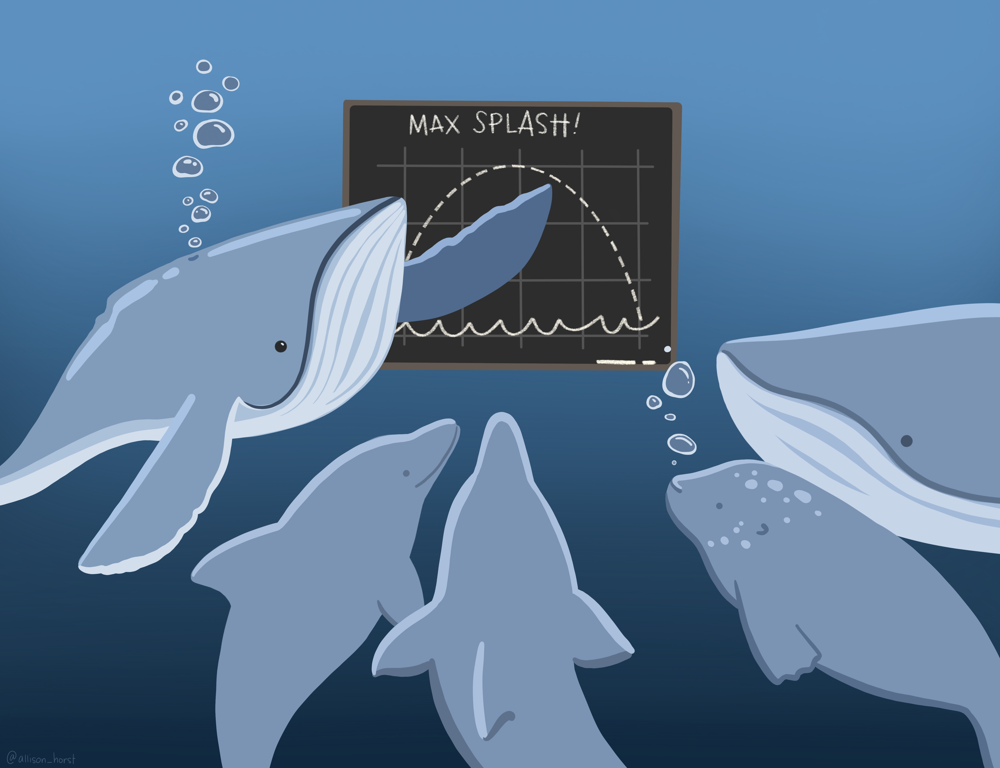

# R for Data Analysis Workshop

**Omid Ghasemi**

*Department of Cognitive Science, Macquarie University*

**Mahdi Mazidi**

*Department of Psychological Sciences, University of Western Australia*

 

These are the materials for the **R for Data Analysis** workshop which held on February, 2021.

A summary of the workshop (including all the codes in a markdown format) can be found here:

- [Workshop Notes](https://omidghasemi21.github.io/r_for_data_analysis/scripts/workshop_notes.html)

 

 

*Artwork by [Allison Horst](https://github.com/allisonhorst/stats-illustrations)*

