This document is the summary of the **R for Data Analysis** workshop. 

All correspondence related to this document should be addressed to: 

<center>
Omid Ghasemi (Macquarie University, Sydney, NSW, 2109, AUSTRALIA) 

Email: omidreza.ghasemi@hdr.mq.edu.au 
</center>


<style>

body{ /* Normal  */
      text-align: justify;
      font-family: "Times New Roman", Times, serif;
}
code.r{ /* Code block */
    font-size: 14px;
}
pre { /* Code block - determines code spacing between lines */
    font-size: 12px;
}

</style>


# Introduction to R

## Basics and Variables

<div class="figure" style="text-align: center">

<p class="caption">Artwork by Allison Horst: https://github.com/allisonhorst/stats-illustrations</p>
</div>


R can be used as a calculator. For mathematical purposes, be careful of the order in which R executes the commands.


```r
10 + 10
```

```
## [1] 20
```

```r
4 ^ 2
```

```
## [1] 16
```

```r
(250 / 500) * 100
```

```
## [1] 50
```

R is a bit flexible with spacing (but no spacing in the name of variables and words)


```r
10+10
```

```
## [1] 20
```

```r
10                 +           10
```

```
## [1] 20
```

R can sometimes tell that you're not finished yet


```r
10 +
```

How to create a *variable*? Variable assignment using `<-` and `=`. Note that R is case sensitive for everything


```r
pay <- 250

month = 12

pay * month
```

```
## [1] 3000
```

```r
salary <- pay * month
```


Few points in naming variables and vectors: use short, informative words, keep same method (e.g., you can use capital letters but it is not recommended, use only _ or . ).

## Function 
Function is a set of statements combined together to perform a specific task. When we use a block of code repeatedly, we can convert it to a function. To write a function, first, you need to *define* it:


```r
my_multiplier <- function(a,b){
  result = a * b
  return (result)
}
```

This code do nothing. To get a result, you need to *call* it:


```r
my_multiplier (a=2, b=4)
```

```
## [1] 8
```

```r
# or: my_multiplier (2, 4)
```

We can set a default value for our arguments:


```r
my_multiplier2 <- function(a,b=4){
  result = a * b
  return (result)
}

my_multiplier2 (a=2)
```

```
## [1] 8
```

```r
# or: my_multiplier (2)
# or: my_multiplier (2, 6)
```

Fortunately, you do not need to write everything from scratch. R has lots of built-in functions that you can use:

```r
round(54.6787)
```

```
## [1] 55
```

```r
round(54.5787, digits = 2)
```

```
## [1] 54.58
```

Use `?` before the function name to get some help. For example, `?round`. You will see many functions in the rest of the workshop.

## Data Types

function `class()` is used to show what is the type of a variable.


1. *Logical*: `TRUE`, `FALSE` can be abbreviated as `T`, `F`.  They has to be capital, 'true' is not a logical data:

```r
class(TRUE)
```

```
## [1] "logical"
```

```r
class(F)
```

```
## [1] "logical"
```

2. *Numeric*: all numbers e.g. 5,  10.5,  11,37;  a special type of numeric is "integer" which is numbers without decimal. Integers are always numeric, but numeric is not always integer:

```r
class(2)
```

```
## [1] "numeric"
```

```r
class(13.46)
```

```
## [1] "numeric"
```

3. *Character*: text for example, "I love R" or "4" or "4.5":

```r
class("ha ha ha ha")
```

```
## [1] "character"
```

```r
class("56.6")
```

```
## [1] "character"
```

```r
class("TRUE")
```

```
## [1] "character"
```

Can we change the type of data in a variable? Yes, you need to use the function `as.---()`


```r
as.numeric(TRUE)
```

```
## [1] 1
```

```r
as.character(4)
```

```
## [1] "4"
```

```r
as.numeric("4.5")
```

```
## [1] 4.5
```

```r
as.numeric("Hello")
```

```
## Warning: NAs introduced by coercion
```

```
## [1] NA
```


## Data Structures


### Vector 

When there are more than one number or letter stored. Use the combine function c() for that.


```r
sale <- c(1, 2, 3,4, 5, 6, 7, 8, 9, 10) # also sale <- c(1:10)

sale <- c(1:10)

sale * sale
```

```
##  [1]   1   4   9  16  25  36  49  64  81 100
```

*Subsetting a vector*:


```r
days <- c("Saturday", "Sunday", "Monday", "Tuesday", "Wednesday", "Thursday", "Friday")

days[2]
```

```
## [1] "Sunday"
```

```r
days[-2]
```

```
## [1] "Saturday"  "Monday"    "Tuesday"   "Wednesday" "Thursday"  "Friday"
```

```r
days[c(2, 3, 4)]
```

```
## [1] "Sunday"  "Monday"  "Tuesday"
```


* *Exercise*: Create a vector named `my_vector` with numbers from 0 to 1000 in it and calculate mean, median, sd, min, max, and sum of that vector:


```r
my_vector <- (0:1000)

mean(my_vector)
```

```
## [1] 500
```

```r
median(my_vector)
```

```
## [1] 500
```

```r
min(my_vector)
```

```
## [1] 0
```

```r
range(my_vector)
```

```
## [1]    0 1000
```

```r
class(my_vector)
```

```
## [1] "integer"
```

```r
sum(my_vector)
```

```
## [1] 500500
```

```r
sd(my_vector)
```

```
## [1] 289.1081
```

### List

List allows you to gather a variety of objects under one name (that is, the name of the list) in an ordered way. These objects can be matrices, vectors, data frames, even other list.


```r
my_list = list(sale, 1, 3, 4:7, "HELLO", "hello", FALSE)
my_list
```

```
## [[1]]
##  [1]  1  2  3  4  5  6  7  8  9 10
## 
## [[2]]
## [1] 1
## 
## [[3]]
## [1] 3
## 
## [[4]]
## [1] 4 5 6 7
## 
## [[5]]
## [1] "HELLO"
## 
## [[6]]
## [1] "hello"
## 
## [[7]]
## [1] FALSE
```

### Factor
Factors store the vector along with the distinct values of the elements in the vector as labels. The labels are always character irrespective of whether it is numeric or character. For example, variable gender with "male" and "female" entries:


```r
gender <- c("male", "male", "male", " female", "female", "female")
gender <- factor(gender)
```

R now treats gender as a nominal (categorical) variable: 1=female, 2=male internally (alphabetically).

```r
summary(gender)
```

```
##  female  female    male 
##       1       2       3
```

* *Question*: why when we ran the above function i.e. summary(), it showed three and not two levels of the data? *Hint*: run 'gender'.


```r
gender
```

```
## [1] male    male    male     female female  female 
## Levels:  female female male
```

So, be careful of spaces!

* *Exercise*: Create a gender factor with 30 male and 40 females (*Hint*: use the `rep()` function):

```r
gender <- c(rep("male",30), rep("female", 40))
gender <- factor(gender)
gender
```

```
##  [1] male   male   male   male   male   male   male   male   male   male  
## [11] male   male   male   male   male   male   male   male   male   male  
## [21] male   male   male   male   male   male   male   male   male   male  
## [31] female female female female female female female female female female
## [41] female female female female female female female female female female
## [51] female female female female female female female female female female
## [61] female female female female female female female female female female
## Levels: female male
```

There are two types of categorical variables: nominal and ordinal. How to create ordered factors (when the variable is nominal and values can be ordered)? We should add two additional arguments to the `factor()` function: `ordered = TRUE`, and `levels = c("level1", "level2")`. For example, we have a vector that shows participants' education level.


```r
edu<-c(3,2,3,4,1,2,2,3,4)

education<-factor(edu, ordered = TRUE)
levels(education) <- c("Primary school","high school","College","Uni graduated")
education
```

```
## [1] College        high school    College        Uni graduated  Primary school
## [6] high school    high school    College        Uni graduated 
## Levels: Primary school < high school < College < Uni graduated
```

* *Exercise*: We have a factor with `patient` and `control` values. Here, the first level is control and the second level is patient. Change the order of levels, so patient would be the first level:


```r
health_status <- factor(c(rep('patient',5),rep('control',5)))
health_status
```

```
##  [1] patient patient patient patient patient control control control control
## [10] control
## Levels: control patient
```

```r
health_status_reordered <- factor(health_status, levels = c('patient','control'))
health_status_reordered
```

```
##  [1] patient patient patient patient patient control control control control
## [10] control
## Levels: patient control
```

Finally, can you relabel both levels to uppercase characters? (*Hint*: check `?factor`)


```r
health_status_relabeled <- factor(health_status, levels = c('patient','control'), labels = c('Patient','Control'))
health_status_relabeled
```

```
##  [1] Patient Patient Patient Patient Patient Control Control Control Control
## [10] Control
## Levels: Patient Control
```


### Matrices
All columns in a matrix must have the same mode(numeric, character, etc.) and the same length. It can be created using a vector input to the matrix function.


```r
my_matrix = matrix(c(1,2,3,4,5,6,7,8,9), nrow = 3, ncol = 3)

my_matrix
```

```
##      [,1] [,2] [,3]
## [1,]    1    4    7
## [2,]    2    5    8
## [3,]    3    6    9
```

### Data frames 

Data frames can hold numeric, character or logical values. Within a column all elements have the same data type, but different columns can be of different data type. Let's create a dataframe:


```r
id <- 1:200
group <- c(rep("Psychotherapy", 100), rep("Medication", 100))
response <- c(rnorm(100, mean = 30, sd = 5),
             rnorm(100, mean = 25, sd = 5))

my_dataframe <-data.frame(Patient = id,
                          Treatment = group,
                          Response = response)
```

We also could have done the below


```r
my_dataframe <-data.frame(Patient = c(1:200),
                          Treatment = c(rep("Psychotherapy", 100), rep("Medication", 100)),
                          Response = c(rnorm(100, mean = 30, sd = 5),
                                       rnorm(100, mean = 25, sd = 5)))
```

In large data sets, the function head() enables you to show the first observations of a data frames. Similarly, the function tail() prints out the last observations in your data set.


```r
head(my_dataframe) 
tail(my_dataframe)
```

<table class="table table-striped table-bordered table-condensed" style="margin-left: auto; margin-right: auto;">
 <thead>
  <tr>
   <th style="text-align:right;position: sticky; top:0; background-color: #FFFFFF;">   </th>
   <th style="text-align:right;position: sticky; top:0; background-color: #FFFFFF;"> Patient </th>
   <th style="text-align:left;position: sticky; top:0; background-color: #FFFFFF;"> Treatment </th>
   <th style="text-align:right;position: sticky; top:0; background-color: #FFFFFF;"> Response </th>
  </tr>
 </thead>
<tbody>
  <tr>
   <td style="text-align:right;"> 1 </td>
   <td style="text-align:right;"> 1 </td>
   <td style="text-align:left;"> Psychotherapy </td>
   <td style="text-align:right;"> 19.45338 </td>
  </tr>
  <tr>
   <td style="text-align:right;"> 2 </td>
   <td style="text-align:right;"> 2 </td>
   <td style="text-align:left;"> Psychotherapy </td>
   <td style="text-align:right;"> 42.34821 </td>
  </tr>
  <tr>
   <td style="text-align:right;"> 3 </td>
   <td style="text-align:right;"> 3 </td>
   <td style="text-align:left;"> Psychotherapy </td>
   <td style="text-align:right;"> 35.61285 </td>
  </tr>
  <tr>
   <td style="text-align:right;"> 4 </td>
   <td style="text-align:right;"> 4 </td>
   <td style="text-align:left;"> Psychotherapy </td>
   <td style="text-align:right;"> 25.17399 </td>
  </tr>
  <tr>
   <td style="text-align:right;"> 5 </td>
   <td style="text-align:right;"> 5 </td>
   <td style="text-align:left;"> Psychotherapy </td>
   <td style="text-align:right;"> 24.42101 </td>
  </tr>
  <tr>
   <td style="text-align:right;"> 6 </td>
   <td style="text-align:right;"> 6 </td>
   <td style="text-align:left;"> Psychotherapy </td>
   <td style="text-align:right;"> 27.48738 </td>
  </tr>
</tbody>
</table>

<table class="table table-striped table-bordered table-condensed" style="margin-left: auto; margin-right: auto;">
 <thead>
  <tr>
   <th style="text-align:left;position: sticky; top:0; background-color: #FFFFFF;">   </th>
   <th style="text-align:right;position: sticky; top:0; background-color: #FFFFFF;"> Patient </th>
   <th style="text-align:left;position: sticky; top:0; background-color: #FFFFFF;"> Treatment </th>
   <th style="text-align:right;position: sticky; top:0; background-color: #FFFFFF;"> Response </th>
  </tr>
 </thead>
<tbody>
  <tr>
   <td style="text-align:left;"> 195 </td>
   <td style="text-align:right;"> 195 </td>
   <td style="text-align:left;"> Medication </td>
   <td style="text-align:right;"> 27.49956 </td>
  </tr>
  <tr>
   <td style="text-align:left;"> 196 </td>
   <td style="text-align:right;"> 196 </td>
   <td style="text-align:left;"> Medication </td>
   <td style="text-align:right;"> 28.42176 </td>
  </tr>
  <tr>
   <td style="text-align:left;"> 197 </td>
   <td style="text-align:right;"> 197 </td>
   <td style="text-align:left;"> Medication </td>
   <td style="text-align:right;"> 28.92391 </td>
  </tr>
  <tr>
   <td style="text-align:left;"> 198 </td>
   <td style="text-align:right;"> 198 </td>
   <td style="text-align:left;"> Medication </td>
   <td style="text-align:right;"> 29.06204 </td>
  </tr>
  <tr>
   <td style="text-align:left;"> 199 </td>
   <td style="text-align:right;"> 199 </td>
   <td style="text-align:left;"> Medication </td>
   <td style="text-align:right;"> 27.61078 </td>
  </tr>
  <tr>
   <td style="text-align:left;"> 200 </td>
   <td style="text-align:right;"> 200 </td>
   <td style="text-align:left;"> Medication </td>
   <td style="text-align:right;"> 18.95131 </td>
  </tr>
</tbody>
</table>

Similar to vectors and matrices, brackets [] are used to selects data from rows and columns in data.frames:


```r
my_dataframe[35, 3]
```

```
## [1] 31.15347
```

* *Exercise*: How can we get all columns, but only for the first 10 participants?


```r
my_dataframe[1:10, ]
```

<table class="table table-striped table-bordered table-condensed" style="margin-left: auto; margin-right: auto;">
 <thead>
  <tr>
   <th style="text-align:right;position: sticky; top:0; background-color: #FFFFFF;"> Patient </th>
   <th style="text-align:left;position: sticky; top:0; background-color: #FFFFFF;"> Treatment </th>
   <th style="text-align:right;position: sticky; top:0; background-color: #FFFFFF;"> Response </th>
  </tr>
 </thead>
<tbody>
  <tr>
   <td style="text-align:right;"> 1 </td>
   <td style="text-align:left;"> Psychotherapy </td>
   <td style="text-align:right;"> 19.45338 </td>
  </tr>
  <tr>
   <td style="text-align:right;"> 2 </td>
   <td style="text-align:left;"> Psychotherapy </td>
   <td style="text-align:right;"> 42.34821 </td>
  </tr>
  <tr>
   <td style="text-align:right;"> 3 </td>
   <td style="text-align:left;"> Psychotherapy </td>
   <td style="text-align:right;"> 35.61285 </td>
  </tr>
  <tr>
   <td style="text-align:right;"> 4 </td>
   <td style="text-align:left;"> Psychotherapy </td>
   <td style="text-align:right;"> 25.17399 </td>
  </tr>
  <tr>
   <td style="text-align:right;"> 5 </td>
   <td style="text-align:left;"> Psychotherapy </td>
   <td style="text-align:right;"> 24.42101 </td>
  </tr>
  <tr>
   <td style="text-align:right;"> 6 </td>
   <td style="text-align:left;"> Psychotherapy </td>
   <td style="text-align:right;"> 27.48738 </td>
  </tr>
  <tr>
   <td style="text-align:right;"> 7 </td>
   <td style="text-align:left;"> Psychotherapy </td>
   <td style="text-align:right;"> 33.11080 </td>
  </tr>
  <tr>
   <td style="text-align:right;"> 8 </td>
   <td style="text-align:left;"> Psychotherapy </td>
   <td style="text-align:right;"> 42.36993 </td>
  </tr>
  <tr>
   <td style="text-align:right;"> 9 </td>
   <td style="text-align:left;"> Psychotherapy </td>
   <td style="text-align:right;"> 40.41996 </td>
  </tr>
  <tr>
   <td style="text-align:right;"> 10 </td>
   <td style="text-align:left;"> Psychotherapy </td>
   <td style="text-align:right;"> 23.41229 </td>
  </tr>
</tbody>
</table>
How to get only the Response column for all participants?


```r
my_dataframe[ , 3]
```

```
##   [1] 19.45338 42.34821 35.61285 25.17399 24.42101 27.48738 33.11080 42.36993
##   [9] 40.41996 23.41229 28.24108 32.81045 25.70502 29.22300 32.27024 33.05726
##  [17] 24.37990 31.37091 31.16245 28.76672 38.54995 22.87417 22.20308 23.74506
##  [25] 25.12223 38.02695 28.44873 30.55478 36.07095 29.76718 37.62122 33.47683
##  [33] 32.37533 31.40624 31.15347 34.65073 22.47355 27.59239 35.01169 36.09953
##  [41] 29.29690 32.29629 31.98906 23.27326 27.44773 31.86654 17.90334 22.97421
##  [49] 30.87948 29.53606 29.08800 30.08908 21.95537 35.25648 30.40872 30.87351
##  [57] 23.57119 29.42636 32.90266 31.78335 35.53556 27.94127 28.05376 21.32260
##  [65] 25.00423 19.52317 37.05042 29.95080 21.99706 26.90433 22.47090 31.14327
##  [73] 40.54168 27.98746 28.14105 31.15181 30.93725 30.65365 23.85351 32.85104
##  [81] 33.16058 32.15789 24.70513 24.71835 29.07822 29.34360 29.97579 24.19834
##  [89] 27.12373 29.85477 27.23954 31.12225 31.72837 30.66292 28.12180 29.38940
##  [97] 35.45928 35.13103 23.55602 21.51178 23.86999 24.08943 21.19567 23.76538
## [105] 31.23768 20.12949 23.35748 25.77560 19.97935 36.95775 33.83174 27.06497
## [113] 20.82996 16.90353 20.63556 22.35301 20.31938 28.19941 31.16086 14.80019
## [121] 30.02522 28.20146 24.90908 17.37278 30.53754 25.74269 24.67774 19.84581
## [129] 15.30539 24.30986 12.59414 21.31042 18.77066 25.84767 28.36952 18.72623
## [137] 26.18819 16.69716 22.39854 23.14091 24.53845 29.56114 18.33816 30.06442
## [145] 26.48275 21.59022 19.16012 27.35389 21.63158 18.79327 20.71436 20.73652
## [153] 30.98289 29.92019 21.84922 24.98820 25.63485 28.40387 28.10618 27.49502
## [161] 22.00292 31.93532 20.70760 26.42307 30.18167 15.52820 21.29023 19.23984
## [169] 19.23642 20.05807 25.03167 31.89290 26.70301 23.68235 20.84122 17.86026
## [177] 33.32782 30.41839 25.10713 23.05902 22.40902 27.36197 24.81034 22.85248
## [185] 22.74278 20.66957 22.41073 19.05380 26.37348 24.48729 30.65553 26.59533
## [193] 30.89649 20.92523 27.49956 28.42176 28.92391 29.06204 27.61078 18.95131
```

Another easier way for selecting particular items is using their names that is more helpful than number of the rows in large data sets:

```r
my_dataframe[ , "Response"]
# OR:
my_dataframe$Response
```

So far, we created dataframes using `data.frame` function from the base R. However, a better way to create dataframes is to use the `tibble` function from tidyverse (see [here](https://r4ds.had.co.nz/tibbles.html)).

# Data Cleaning

<div class="figure" style="text-align: center">

<p class="caption">Artwork by Allison Horst: https://github.com/allisonhorst/stats-illustrations</p>
</div>


<div class="figure" style="text-align: center">

<p class="caption">Artwork by Allison Horst: https://github.com/allisonhorst/stats-illustrations</p>
</div>

Now, suppose we ran an experiment with 141 depressed patients. Participants were randomly assigned into two treatment groups: CBT or Psychodynamic psychotherapy. We measured self-report depression scores at 5 different stages of treatment: 

- Stage 1: Before starting any treatment. It is our base stage (pre-test)
- Stage 2: After 5 sessions of psychotherapy (post-test1)
- Stage 3: After 10 sessions of psychotherapy (post-test2)
- Stage 4: At the end of the treatment (post-test3)
- Stage 5: Three months after the treatment (post-test4)

let's read and check the uncleaned data. But, first thing first. let's install and then load the tidyvese package. We also need some other packages:


```r
# Install it
install.packages("tidyverse")

# And then load it
library(tidyverse)

# Load other packages that you have already installed
library(here)
library(janitor)
library(broom)
library(afex)
library(emmeans)
library(knitr)
library(kableExtra)
library(ggsci)
library(patchwork)
library(skimr)
# install.packages("devtools")
# devtools::install_github("easystats/correlation")
library("correlation")
options(scipen=999) # turn off scientific notations
options(contrasts = c('contr.sum','contr.poly')) # set the contrast sum globally 
options(knitr.kable.NA = '')
```


```r
# read the raw data
raw_data <- read_csv(here("raw_data","raw_data_exp1.csv"))
head(raw_data)
```

<div style="border: 1px solid #ddd; padding: 5px; overflow-x: scroll; width:780px; "><table class="table table-striped table-bordered table-condensed" style="width: auto !important; margin-left: auto; margin-right: auto;">
 <thead>
  <tr>
   <th style="text-align:right;position: sticky; top:0; background-color: #FFFFFF;"> progress </th>
   <th style="text-align:left;position: sticky; top:0; background-color: #FFFFFF;"> subject </th>
   <th style="text-align:left;position: sticky; top:0; background-color: #FFFFFF;"> response_id </th>
   <th style="text-align:left;position: sticky; top:0; background-color: #FFFFFF;"> consent_form </th>
   <th style="text-align:right;position: sticky; top:0; background-color: #FFFFFF;"> age </th>
   <th style="text-align:left;position: sticky; top:0; background-color: #FFFFFF;"> gender </th>
   <th style="text-align:right;position: sticky; top:0; background-color: #FFFFFF;"> stage1_cbt </th>
   <th style="text-align:right;position: sticky; top:0; background-color: #FFFFFF;"> stage2_cbt </th>
   <th style="text-align:right;position: sticky; top:0; background-color: #FFFFFF;"> stage3_cbt </th>
   <th style="text-align:right;position: sticky; top:0; background-color: #FFFFFF;"> stage4_cbt </th>
   <th style="text-align:right;position: sticky; top:0; background-color: #FFFFFF;"> stage5_cbt </th>
   <th style="text-align:right;position: sticky; top:0; background-color: #FFFFFF;"> stage1_dynamic </th>
   <th style="text-align:right;position: sticky; top:0; background-color: #FFFFFF;"> stage2_dynamic </th>
   <th style="text-align:right;position: sticky; top:0; background-color: #FFFFFF;"> stage3_dynamic </th>
   <th style="text-align:right;position: sticky; top:0; background-color: #FFFFFF;"> stage4_dynamic </th>
   <th style="text-align:right;position: sticky; top:0; background-color: #FFFFFF;"> stage5_dynamic </th>
   <th style="text-align:right;position: sticky; top:0; background-color: #FFFFFF;"> anxiety1 </th>
   <th style="text-align:right;position: sticky; top:0; background-color: #FFFFFF;"> anxiety2 </th>
   <th style="text-align:right;position: sticky; top:0; background-color: #FFFFFF;"> anxiety3 </th>
   <th style="text-align:right;position: sticky; top:0; background-color: #FFFFFF;"> anxiety4 </th>
   <th style="text-align:right;position: sticky; top:0; background-color: #FFFFFF;"> anxiety5 </th>
   <th style="text-align:right;position: sticky; top:0; background-color: #FFFFFF;"> anxiety6 </th>
   <th style="text-align:right;position: sticky; top:0; background-color: #FFFFFF;"> anxiety7 </th>
   <th style="text-align:right;position: sticky; top:0; background-color: #FFFFFF;"> anxiety8 </th>
   <th style="text-align:left;position: sticky; top:0; background-color: #FFFFFF;"> group </th>
   <th style="text-align:right;position: sticky; top:0; background-color: #FFFFFF;"> sleep_quality </th>
   <th style="text-align:right;position: sticky; top:0; background-color: #FFFFFF;"> life_satisfaction </th>
  </tr>
 </thead>
<tbody>
  <tr>
   <td style="text-align:right;"> 100 </td>
   <td style="text-align:left;"> subj1 </td>
   <td style="text-align:left;"> R_1f298znjmVzcOjp </td>
   <td style="text-align:left;"> I consent </td>
   <td style="text-align:right;"> 18 </td>
   <td style="text-align:left;"> Female </td>
   <td style="text-align:right;">  </td>
   <td style="text-align:right;">  </td>
   <td style="text-align:right;">  </td>
   <td style="text-align:right;">  </td>
   <td style="text-align:right;">  </td>
   <td style="text-align:right;"> 90 </td>
   <td style="text-align:right;"> 31 </td>
   <td style="text-align:right;"> 33 </td>
   <td style="text-align:right;"> 47 </td>
   <td style="text-align:right;"> 50 </td>
   <td style="text-align:right;"> 5 </td>
   <td style="text-align:right;"> 5 </td>
   <td style="text-align:right;"> 5 </td>
   <td style="text-align:right;"> 5 </td>
   <td style="text-align:right;"> 5 </td>
   <td style="text-align:right;"> 6 </td>
   <td style="text-align:right;"> 5 </td>
   <td style="text-align:right;"> 3 </td>
   <td style="text-align:left;"> Psychodynamic </td>
   <td style="text-align:right;"> 9 </td>
   <td style="text-align:right;"> 9 </td>
  </tr>
  <tr>
   <td style="text-align:right;"> 100 </td>
   <td style="text-align:left;"> subj2 </td>
   <td style="text-align:left;"> R_tL0A9P33Gi18I0N </td>
   <td style="text-align:left;"> I consent </td>
   <td style="text-align:right;"> 18 </td>
   <td style="text-align:left;"> Male </td>
   <td style="text-align:right;"> 78 </td>
   <td style="text-align:right;"> 46 </td>
   <td style="text-align:right;"> 46 </td>
   <td style="text-align:right;"> 11 </td>
   <td style="text-align:right;"> 13 </td>
   <td style="text-align:right;">  </td>
   <td style="text-align:right;">  </td>
   <td style="text-align:right;">  </td>
   <td style="text-align:right;">  </td>
   <td style="text-align:right;">  </td>
   <td style="text-align:right;"> 6 </td>
   <td style="text-align:right;"> 6 </td>
   <td style="text-align:right;"> 6 </td>
   <td style="text-align:right;"> 5 </td>
   <td style="text-align:right;"> 6 </td>
   <td style="text-align:right;"> 6 </td>
   <td style="text-align:right;"> 5 </td>
   <td style="text-align:right;"> 6 </td>
   <td style="text-align:left;"> CBT </td>
   <td style="text-align:right;"> 9 </td>
   <td style="text-align:right;"> 10 </td>
  </tr>
  <tr>
   <td style="text-align:right;"> 100 </td>
   <td style="text-align:left;"> subj3 </td>
   <td style="text-align:left;"> R_1LNyJhCKxTAAMOW </td>
   <td style="text-align:left;"> I consent </td>
   <td style="text-align:right;"> 19 </td>
   <td style="text-align:left;"> Female </td>
   <td style="text-align:right;"> 68 </td>
   <td style="text-align:right;"> 51 </td>
   <td style="text-align:right;"> 24 </td>
   <td style="text-align:right;"> 41 </td>
   <td style="text-align:right;"> 24 </td>
   <td style="text-align:right;">  </td>
   <td style="text-align:right;">  </td>
   <td style="text-align:right;">  </td>
   <td style="text-align:right;">  </td>
   <td style="text-align:right;">  </td>
   <td style="text-align:right;"> 6 </td>
   <td style="text-align:right;"> 5 </td>
   <td style="text-align:right;"> 4 </td>
   <td style="text-align:right;"> 5 </td>
   <td style="text-align:right;"> 5 </td>
   <td style="text-align:right;"> 6 </td>
   <td style="text-align:right;"> 5 </td>
   <td style="text-align:right;"> 6 </td>
   <td style="text-align:left;"> CBT </td>
   <td style="text-align:right;"> 10 </td>
   <td style="text-align:right;"> 8 </td>
  </tr>
  <tr>
   <td style="text-align:right;"> 100 </td>
   <td style="text-align:left;"> subj4 </td>
   <td style="text-align:left;"> R_3enxzUsEYgs5r1a </td>
   <td style="text-align:left;"> I consent </td>
   <td style="text-align:right;"> 27 </td>
   <td style="text-align:left;"> Female </td>
   <td style="text-align:right;">  </td>
   <td style="text-align:right;">  </td>
   <td style="text-align:right;">  </td>
   <td style="text-align:right;">  </td>
   <td style="text-align:right;">  </td>
   <td style="text-align:right;"> 100 </td>
   <td style="text-align:right;"> 21 </td>
   <td style="text-align:right;"> 11 </td>
   <td style="text-align:right;"> 6 </td>
   <td style="text-align:right;"> 31 </td>
   <td style="text-align:right;"> 6 </td>
   <td style="text-align:right;"> 6 </td>
   <td style="text-align:right;"> 6 </td>
   <td style="text-align:right;"> 1 </td>
   <td style="text-align:right;"> 6 </td>
   <td style="text-align:right;"> 6 </td>
   <td style="text-align:right;"> 6 </td>
   <td style="text-align:right;"> 1 </td>
   <td style="text-align:left;"> Psychodynamic </td>
   <td style="text-align:right;"> 8 </td>
   <td style="text-align:right;"> 7 </td>
  </tr>
  <tr>
   <td style="text-align:right;"> 100 </td>
   <td style="text-align:left;"> subj5 </td>
   <td style="text-align:left;"> R_2Qzl2096a4KNE29 </td>
   <td style="text-align:left;"> I consent </td>
   <td style="text-align:right;"> 19 </td>
   <td style="text-align:left;"> Male </td>
   <td style="text-align:right;"> 30 </td>
   <td style="text-align:right;"> 28 </td>
   <td style="text-align:right;"> 16 </td>
   <td style="text-align:right;"> 6 </td>
   <td style="text-align:right;"> 6 </td>
   <td style="text-align:right;">  </td>
   <td style="text-align:right;">  </td>
   <td style="text-align:right;">  </td>
   <td style="text-align:right;">  </td>
   <td style="text-align:right;">  </td>
   <td style="text-align:right;"> 6 </td>
   <td style="text-align:right;"> 6 </td>
   <td style="text-align:right;"> 5 </td>
   <td style="text-align:right;"> 5 </td>
   <td style="text-align:right;"> 6 </td>
   <td style="text-align:right;"> 6 </td>
   <td style="text-align:right;"> 6 </td>
   <td style="text-align:right;"> 6 </td>
   <td style="text-align:left;"> CBT </td>
   <td style="text-align:right;"> 11 </td>
   <td style="text-align:right;"> 11 </td>
  </tr>
  <tr>
   <td style="text-align:right;"> 100 </td>
   <td style="text-align:left;"> subj6 </td>
   <td style="text-align:left;"> R_esb71WOTQySjusF </td>
   <td style="text-align:left;"> I consent </td>
   <td style="text-align:right;"> 20 </td>
   <td style="text-align:left;"> Female </td>
   <td style="text-align:right;">  </td>
   <td style="text-align:right;">  </td>
   <td style="text-align:right;">  </td>
   <td style="text-align:right;">  </td>
   <td style="text-align:right;">  </td>
   <td style="text-align:right;"> 79 </td>
   <td style="text-align:right;"> 1 </td>
   <td style="text-align:right;"> 57 </td>
   <td style="text-align:right;"> 46 </td>
   <td style="text-align:right;"> 57 </td>
   <td style="text-align:right;"> 6 </td>
   <td style="text-align:right;"> 6 </td>
   <td style="text-align:right;"> 6 </td>
   <td style="text-align:right;"> 5 </td>
   <td style="text-align:right;"> 6 </td>
   <td style="text-align:right;"> 6 </td>
   <td style="text-align:right;"> 6 </td>
   <td style="text-align:right;"> 6 </td>
   <td style="text-align:left;"> Psychodynamic </td>
   <td style="text-align:right;"> 10 </td>
   <td style="text-align:right;"> 10 </td>
  </tr>
</tbody>
</table></div>

* *Exercise*: There is a dataset in the `cleaned_data` folder named `unicef_u5mr.csv`. Read the dataset using `read_csv` and `here`.

```r
unicef_data <- read_csv(here("cleaned_data","unicef_u5mr.csv"))
```

<div class="figure" style="text-align: center">

<p class="caption">Artwork by Allison Horst: https://github.com/allisonhorst/stats-illustrations</p>
</div>

In order to clean the data, we use *tidyverse* which is a collection of packages to work with data. One of the tidyverse packages that we use regularly is `dplyr` which includes several functions:

- `mutate()` adds new variables or change existing ones.
- `select()` pick variables (columns) based on their names.
- `filter()` picks cases (rows) based on their values.
- `summarise()` gives a single single summary of the data (e.g., mean, counts, etc.)
- `arrange()` changes the ordering of the rows.
- `group_by()` divides your dataframe into grouped dataframes and allow you to do each of the above operations (except for `arrange`) on every one of them separately.

## Select

Pick `subject`, `age`, and `gender` columns:


```r
selected_data <- select(raw_data, subject, age, gender)
```

## Filter
Now, do the following tasks: pick all the male participants, pick all the male participants **or** those greater than 25 years old, and finally pick all male participants **and** those greater than 25 years old:


```r
# filter all males
fil_male <- filter(raw_data, gender == "Male")
# filter males and older than 25
fil_male_and_g25 <- filter(raw_data, gender == "Male" & age > 25 )
# filter males or older than 25
fil_male_or_g25 <- filter(raw_data, gender == "Male" | age > 25 )
```

## Arrange 
Arrange (order) your dataframe based on the age, once in an ascending order (youngers first) and once based on descending order (olders first):


```r
# order participants based on their age
arranged_data <- arrange(raw_data, age)
# order participants based on their age (descendeing)
arranged_descending <- arrange(raw_data, desc(age))
```

## Mutate
Create a column to show if the participant has finished the task or not:

```r
mutated_data <- mutate (raw_data, finished= case_when(progress==100~ "Yes",T~ "No"))
```

## Summarise
Summarize participants age and sd:

```r
summarise(raw_data, mean= mean(age, na.rm=T),
          sd= sd (age, na.rm=T))
```

<div class="kable-table">

<table>
 <thead>
  <tr>
   <th style="text-align:right;"> mean </th>
   <th style="text-align:right;"> sd </th>
  </tr>
 </thead>
<tbody>
  <tr>
   <td style="text-align:right;"> 21.27273 </td>
   <td style="text-align:right;"> 6.635655 </td>
  </tr>
</tbody>
</table>

</div>

## Pipe Operators
A new function: **pipe operators** `%>%` pipes a value into the next function:


```r
raw_data %>% 
  summarise(., mean= mean(age, na.rm=T),
            sd= sd (age, na.rm=T))
```

<div class="kable-table">

<table>
 <thead>
  <tr>
   <th style="text-align:right;"> mean </th>
   <th style="text-align:right;"> sd </th>
  </tr>
 </thead>
<tbody>
  <tr>
   <td style="text-align:right;"> 21.27273 </td>
   <td style="text-align:right;"> 6.635655 </td>
  </tr>
</tbody>
</table>

</div>


```r
raw_data %>% 
  summarise(mean= mean(age, na.rm=T),
            sd= sd (age, na.rm=T))
```

<div class="kable-table">

<table>
 <thead>
  <tr>
   <th style="text-align:right;"> mean </th>
   <th style="text-align:right;"> sd </th>
  </tr>
 </thead>
<tbody>
  <tr>
   <td style="text-align:right;"> 21.27273 </td>
   <td style="text-align:right;"> 6.635655 </td>
  </tr>
</tbody>
</table>

</div>

Calculate the age mean of younger than 25 participants only:


```r
raw_data %>% 
  filter (age < 25) %>%
  summarise(mean= mean(age, na.rm=T),
            sd= sd (age, na.rm=T))
```

<div class="kable-table">

<table>
 <thead>
  <tr>
   <th style="text-align:right;"> mean </th>
   <th style="text-align:right;"> sd </th>
  </tr>
 </thead>
<tbody>
  <tr>
   <td style="text-align:right;"> 19.1913 </td>
   <td style="text-align:right;"> 1.515393 </td>
  </tr>
</tbody>
</table>

</div>

## Group By

Calculate the age mean of younger than 25 participants  for each gender separately:


```r
raw_data %>% 
  filter (age < 25) %>%
  group_by(gender) %>%
  summarise(mean= mean(age, na.rm=T),
            sd= sd (age, na.rm=T)) %>%
  ungroup ()
```

<div class="kable-table">

<table>
 <thead>
  <tr>
   <th style="text-align:left;"> gender </th>
   <th style="text-align:right;"> mean </th>
   <th style="text-align:right;"> sd </th>
  </tr>
 </thead>
<tbody>
  <tr>
   <td style="text-align:left;"> Female </td>
   <td style="text-align:right;"> 19.21053 </td>
   <td style="text-align:right;"> 1.556693 </td>
  </tr>
  <tr>
   <td style="text-align:left;"> Male </td>
   <td style="text-align:right;"> 19.10000 </td>
   <td style="text-align:right;"> 1.333772 </td>
  </tr>
</tbody>
</table>

</div>


* *Exercise*: Create a column to show if participant is older than 23 or not and then calculate sleep quality (`sleep_quality`) mean for each group separately:

```r
raw_data %>%
  mutate(age_group = case_when(age > 23 ~ "greater than 23", T~ "younger than 23")) %>%
  group_by(age_group) %>%
  summarise(sleep_quality = mean(sleep_quality, na.rm=T))
```

<div class="kable-table">

<table>
 <thead>
  <tr>
   <th style="text-align:left;"> age_group </th>
   <th style="text-align:right;"> sleep_quality </th>
  </tr>
 </thead>
<tbody>
  <tr>
   <td style="text-align:left;"> greater than 23 </td>
   <td style="text-align:right;"> 9.000000 </td>
  </tr>
  <tr>
   <td style="text-align:left;"> younger than 23 </td>
   <td style="text-align:right;"> 8.107438 </td>
  </tr>
</tbody>
</table>

</div>

* *Exercise*: Add the anxiety total score (sum) to the dataframe and then convert subject column to factor:

```r
anxiety_data <- raw_data %>%
  mutate(anxiety_total= anxiety1+anxiety2+anxiety3+anxiety4+anxiety5+anxiety6+anxiety7+anxiety8) %>%
  mutate(subject= factor(subject))
```

## Pivoting

Next, we want to pivot our data to switch between long and wide format:

<div class="figure" style="text-align: center">

<p class="caption">Artwork by Allison Horst: https://github.com/allisonhorst/stats-illustrations</p>
</div>


```r
# Make you data long
long_data <- raw_data %>%
  select(subject, stage1_cbt:stage5_cbt,stage1_dynamic:stage5_dynamic) %>%
  pivot_longer(cols = c(stage1_cbt:stage5_dynamic), names_to = 'stage', values_to = 'depression_score')

# Make you data wide
wide_data <- long_data %>%
  pivot_wider(names_from = stage, values_from= depression_score)
```

* *Exercise*: Convert the UNICEF dataset to long and wide formats:

```r
unicef_data <- read_csv(here("cleaned_data","unicef_u5mr.csv"))

library(janitor)
unicef_data_cleaned <- unicef_data %>%
  clean_names()

unicef_long_data <- unicef_data_cleaned %>% pivot_longer(cols = c(u5mr_1950:u5mr_2015), names_to = 'year', values_to = 'u5mr')
unicef_wideg_data <- unicef_long_data %>% pivot_wider(names_from = 'year', values_from = 'u5mr')
```

*Note*: The codes for the previous exercise were taken from [this blog post](https://sejdemyr.github.io/r-tutorials/basics/wide-and-long/) written by Simon Ejdemyr.

Now, let's do some cleaning using `dplyr`, `tidyr` and other `tidyverse` libraries: 

```r
cleaned_data <- raw_data %>% 
  filter(progress == 100) %>% # filter out unfinished participants
  select(-consent_form) %>% #remove some useless columns
  # create a total score for our questionnaire
  mutate(anxiety_total= anxiety1+anxiety2+anxiety3+anxiety4+anxiety5+anxiety6+anxiety7+anxiety8) %>%
  select(-anxiety1:-anxiety8) %>%
  # make our dataframe long
  pivot_longer(cols = c(stage1_cbt:stage5_cbt,stage1_dynamic:stage5_dynamic),names_to = 'stage',values_to = 'depression_score') %>% 
  #pivot_wider(names_from = stage, values_from= depression_score) # this code change our dataframe back to wide
  filter(!is.na(depression_score)) %>% #remove rows with depression_score == NA
  mutate(stage= gsub("_.*", "", stage)) %>%
  select (subject, age, gender, group, stage, depression_score, anxiety_total, sleep_quality, life_satisfaction)
```


<div style="border: 1px solid #ddd; padding: 5px; overflow-x: scroll; width:780px; "><table class="table table-striped table-bordered table-condensed" style="width: auto !important; margin-left: auto; margin-right: auto;">
 <thead>
  <tr>
   <th style="text-align:left;position: sticky; top:0; background-color: #FFFFFF;"> subject </th>
   <th style="text-align:right;position: sticky; top:0; background-color: #FFFFFF;"> age </th>
   <th style="text-align:left;position: sticky; top:0; background-color: #FFFFFF;"> gender </th>
   <th style="text-align:left;position: sticky; top:0; background-color: #FFFFFF;"> group </th>
   <th style="text-align:left;position: sticky; top:0; background-color: #FFFFFF;"> stage </th>
   <th style="text-align:right;position: sticky; top:0; background-color: #FFFFFF;"> depression_score </th>
   <th style="text-align:right;position: sticky; top:0; background-color: #FFFFFF;"> anxiety_total </th>
   <th style="text-align:right;position: sticky; top:0; background-color: #FFFFFF;"> sleep_quality </th>
   <th style="text-align:right;position: sticky; top:0; background-color: #FFFFFF;"> life_satisfaction </th>
  </tr>
 </thead>
<tbody>
  <tr>
   <td style="text-align:left;"> subj1 </td>
   <td style="text-align:right;"> 18 </td>
   <td style="text-align:left;"> Female </td>
   <td style="text-align:left;"> Psychodynamic </td>
   <td style="text-align:left;"> stage1 </td>
   <td style="text-align:right;"> 90 </td>
   <td style="text-align:right;"> 39 </td>
   <td style="text-align:right;"> 9 </td>
   <td style="text-align:right;"> 9 </td>
  </tr>
  <tr>
   <td style="text-align:left;"> subj1 </td>
   <td style="text-align:right;"> 18 </td>
   <td style="text-align:left;"> Female </td>
   <td style="text-align:left;"> Psychodynamic </td>
   <td style="text-align:left;"> stage2 </td>
   <td style="text-align:right;"> 31 </td>
   <td style="text-align:right;"> 39 </td>
   <td style="text-align:right;"> 9 </td>
   <td style="text-align:right;"> 9 </td>
  </tr>
  <tr>
   <td style="text-align:left;"> subj1 </td>
   <td style="text-align:right;"> 18 </td>
   <td style="text-align:left;"> Female </td>
   <td style="text-align:left;"> Psychodynamic </td>
   <td style="text-align:left;"> stage3 </td>
   <td style="text-align:right;"> 33 </td>
   <td style="text-align:right;"> 39 </td>
   <td style="text-align:right;"> 9 </td>
   <td style="text-align:right;"> 9 </td>
  </tr>
  <tr>
   <td style="text-align:left;"> subj1 </td>
   <td style="text-align:right;"> 18 </td>
   <td style="text-align:left;"> Female </td>
   <td style="text-align:left;"> Psychodynamic </td>
   <td style="text-align:left;"> stage4 </td>
   <td style="text-align:right;"> 47 </td>
   <td style="text-align:right;"> 39 </td>
   <td style="text-align:right;"> 9 </td>
   <td style="text-align:right;"> 9 </td>
  </tr>
  <tr>
   <td style="text-align:left;"> subj1 </td>
   <td style="text-align:right;"> 18 </td>
   <td style="text-align:left;"> Female </td>
   <td style="text-align:left;"> Psychodynamic </td>
   <td style="text-align:left;"> stage5 </td>
   <td style="text-align:right;"> 50 </td>
   <td style="text-align:right;"> 39 </td>
   <td style="text-align:right;"> 9 </td>
   <td style="text-align:right;"> 9 </td>
  </tr>
  <tr>
   <td style="text-align:left;"> subj2 </td>
   <td style="text-align:right;"> 18 </td>
   <td style="text-align:left;"> Male </td>
   <td style="text-align:left;"> CBT </td>
   <td style="text-align:left;"> stage1 </td>
   <td style="text-align:right;"> 78 </td>
   <td style="text-align:right;"> 46 </td>
   <td style="text-align:right;"> 9 </td>
   <td style="text-align:right;"> 10 </td>
  </tr>
</tbody>
</table></div>

Ok, now the data is clean and tidy which means:

> 1. Each variable forms a column.
2. Each observation forms a row.
3. Each type of observational unit forms a table ([Wickham](https://vita.had.co.nz/papers/tidy-data.pdf), 2014).


Check the dataframe and all the data types:

```r
str(cleaned_data)
```

```
## tibble [655 × 9] (S3: tbl_df/tbl/data.frame)
##  $ subject          : chr [1:655] "subj1" "subj1" "subj1" "subj1" ...
##  $ age              : num [1:655] 18 18 18 18 18 18 18 18 18 18 ...
##  $ gender           : chr [1:655] "Female" "Female" "Female" "Female" ...
##  $ group            : chr [1:655] "Psychodynamic" "Psychodynamic" "Psychodynamic" "Psychodynamic" ...
##  $ stage            : chr [1:655] "stage1" "stage2" "stage3" "stage4" ...
##  $ depression_score : num [1:655] 90 31 33 47 50 78 46 46 11 13 ...
##  $ anxiety_total    : num [1:655] 39 39 39 39 39 46 46 46 46 46 ...
##  $ sleep_quality    : num [1:655] 9 9 9 9 9 9 9 9 9 9 ...
##  $ life_satisfaction: num [1:655] 9 9 9 9 9 10 10 10 10 10 ...
```

Finally, we save our data to the `cleaned_data` folder.


```r
write_csv(cleaned_data, here("cleaned_data","cleaned_data_exp1.csv"))
```


# Data Visualization

<div class="figure" style="text-align: center">

<p class="caption">Artwork by Allison Horst: https://github.com/allisonhorst/stats-illustrations</p>
</div>

Before starting the ggplot, let's try a visualization using a function from the Base R the plot() function shows the association of each variable against the other one in a data handy for data with few number of variables to see if there are any patterns


```r
exam_data<- read_csv(here::here("cleaned_data", "exam_data.csv"))

plot(x = exam_data$Anxiety, y = exam_data$Exam)
```

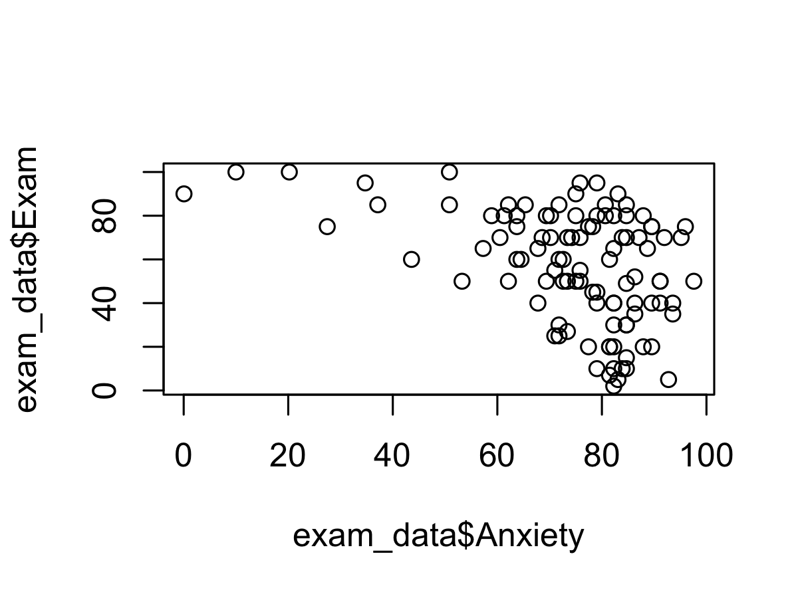

The code also works without writing x and y, however, writing them is strongly recommended


```r
plot(exam_data$Anxiety, exam_data$Exam)
```

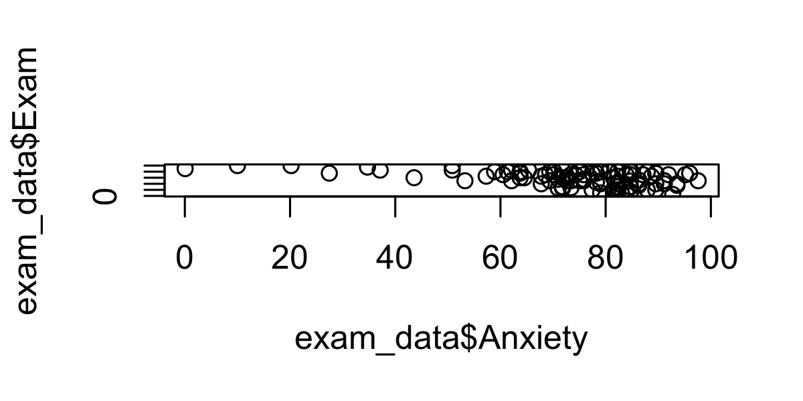

`ggplot`, the gg in ggplot stands for grammar of graphics. Grammar of graphics basically says any graphical representation of data, can be produced by a series of layers. You can think of a layer as a plastic transparency. Lets draw the same plot using ggplot. Always, mention the data we are going to work with.

```r
ggplot(data = exam_data, aes(x = Exam, y = Anxiety))
```

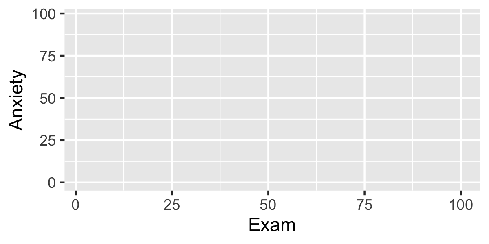


- `aes`: aes which stands for aesthetics is a relationship between a variable in your dataset and an aspect of the plot that is going to visually convey the information to the reader

- Visual elements are known as geoms (short for 'geometric objects') in ggplot 2. When we define a layer, we have to tell R what geom we want displayed on that layer (do we want a bar, line dot, etc.?)


```r
ggplot(data = exam_data, aes(x = Exam, y = Anxiety))+ geom_point()
```

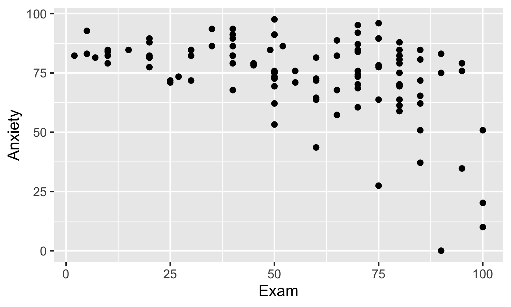

So, lets try some of them here like shape and size. Be careful with the + sign, if you clink enter for the next part of the code, the + sign should not go to the next line


```r
ggplot(data = exam_data, aes(x = Exam, y = Anxiety))+
  geom_point(size = 2, shape = 8)
```

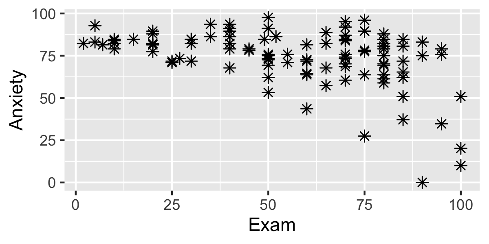

The current plot is not very informative about the patterns for each gender.

```r
ggplot(data = exam_data, aes(x = Exam, y = Anxiety, color = Gender))+
  geom_point(size = 2, shape = 10)
```

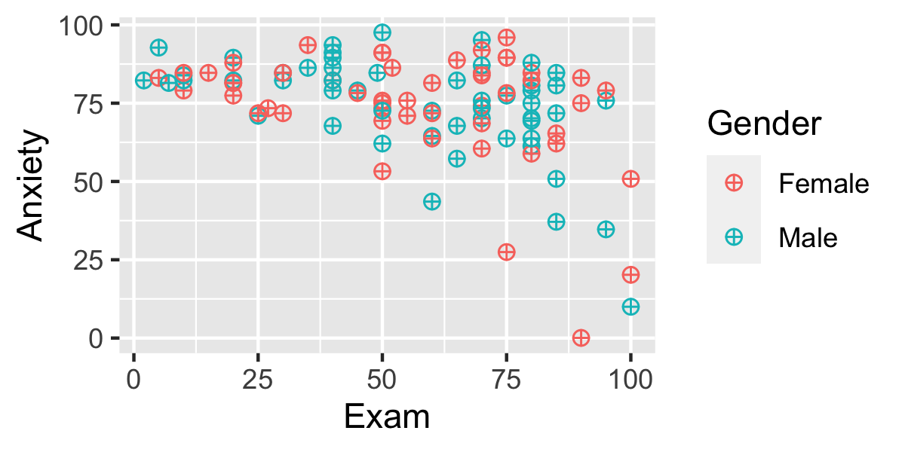

```r
ggplot(data = exam_data, aes(x = Exam, y = Anxiety, color = Gender, shape = Gender))+
  geom_point(size = 2, shape = 10)
```


Question: why the above code doesn't make any change?


```r
ggplot(data = exam_data, aes(x = Exam, y = Anxiety, color = Gender, shape = Gender))+
  geom_point(size = 2)
```

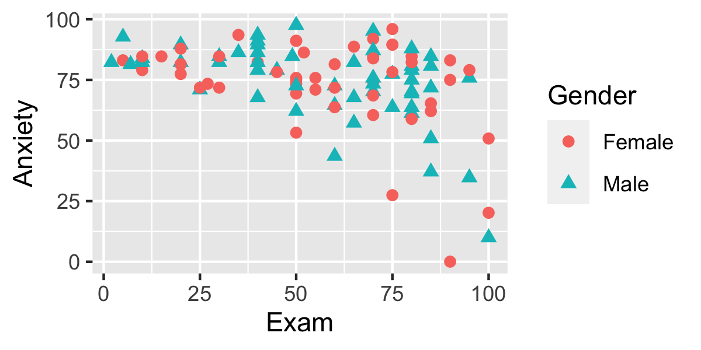

Can assign the first layer to a variable to reduce the length of codes for next layers.


```r
My_graph <- ggplot(data = exam_data, aes(x = Exam, y = Anxiety))

My_graph + geom_point()
```

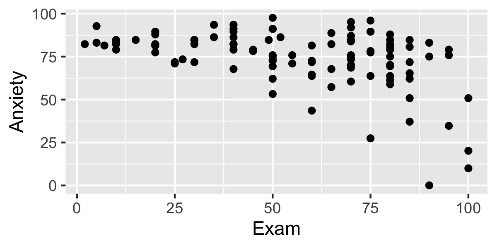

lets add a line to the current graph

```r
My_graph + geom_point() + geom_smooth()
```

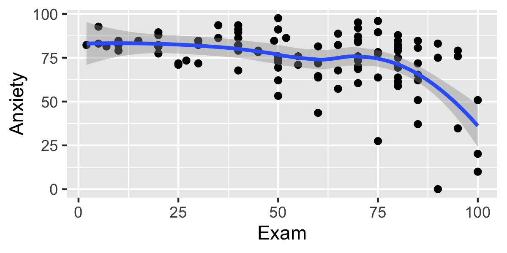

Aesthetics can be set for all layers of the plot (i.e., defined in the plot as a whole) or can be set individually for each geom in a plot.


```r
My_graph + geom_point(aes(color = Gender)) + geom_smooth()
```

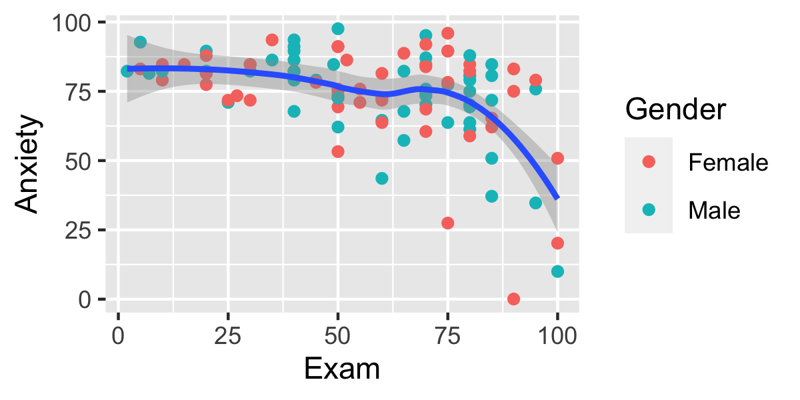

```r
My_graph + geom_point(aes(color = Gender)) + geom_smooth(aes(color = Gender))
```

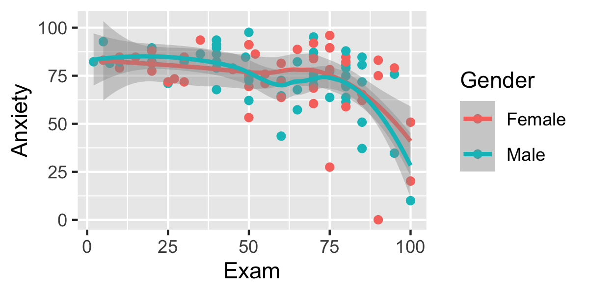

The shaded area around the line is the 95% confidence interval around the line. We can switch this off by  adding `se = F` (which is short for 'standard error = False')


```r
My_graph + geom_point() + geom_smooth(se = F)
```

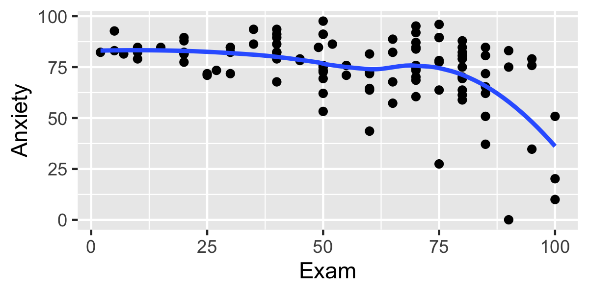


What if we want our line to be a direct line?

```r
My_graph + geom_point() + geom_smooth(se = F, method = lm)
```

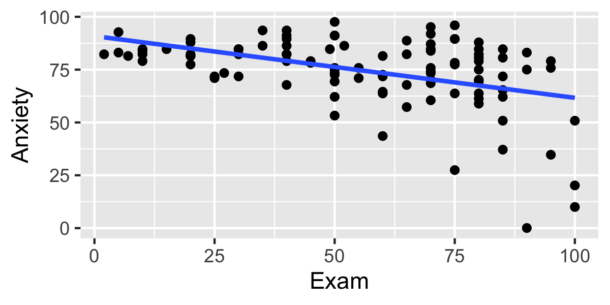
How to change the labels of x and y axes?

```r
My_graph + geom_point() + geom_smooth(se = F, method = lm) +
  labs(x = "Exam scores %", y = "Anxiety scores")
```

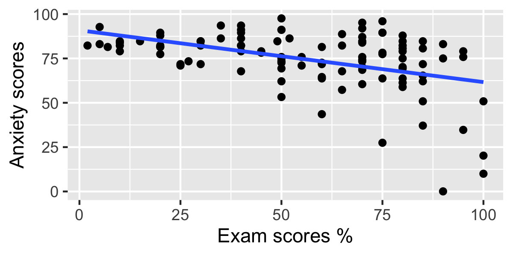

Histograms are used to show distributions of variables while bar charts are used to compare variables. Histograms plot quantitative data with ranges of the data grouped into bins or intervals while bar charts plot categorical data.


```r
#ggplot(data = exam_data, aes(x = Anxiety, y = Exam )) + geom_histogram()
# the code above gives an error as geom_histogram can only have x or y axis in its aes()

ggplot(data = exam_data, aes(x = Anxiety)) + geom_histogram()
```

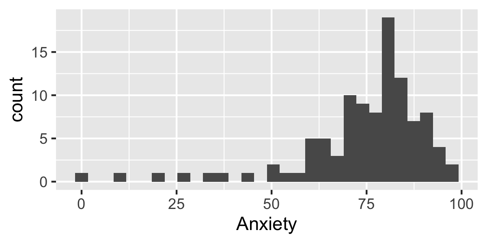

```r
ggplot(data = exam_data, aes(y = Anxiety)) + geom_histogram()
```

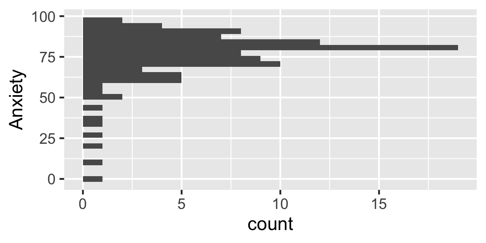

```r
ggplot(data = exam_data, aes(x = Anxiety)) + geom_histogram(bins = 31)
```

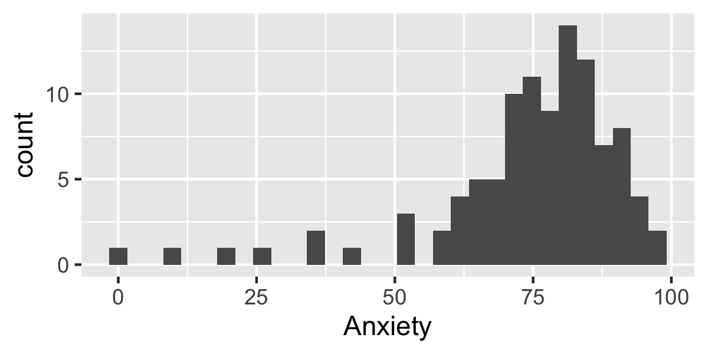

```r
ggplot(data = exam_data, aes(x = Anxiety)) + geom_histogram(bins = 31, fill = "green")
```

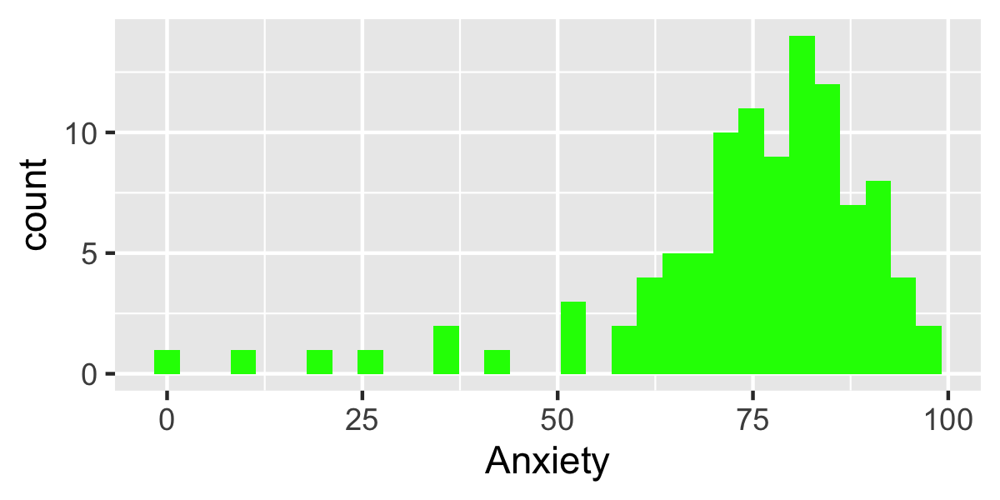

```r
ggplot(data = exam_data, aes(x = Anxiety)) + geom_histogram(bins = 31, fill = "green", col = "red")
```

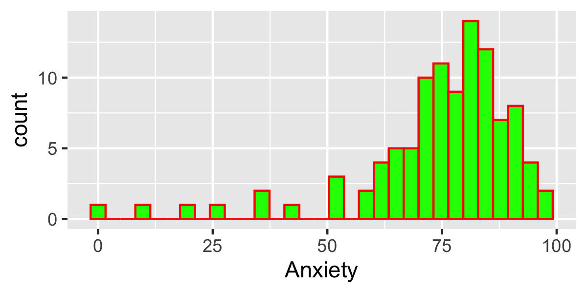

Let's stop using the My_graph variable and write the whole code from the start again for a bar chart

```r
ggplot(data = exam_data, aes(x = Sleep_quality))+
  geom_bar()
```

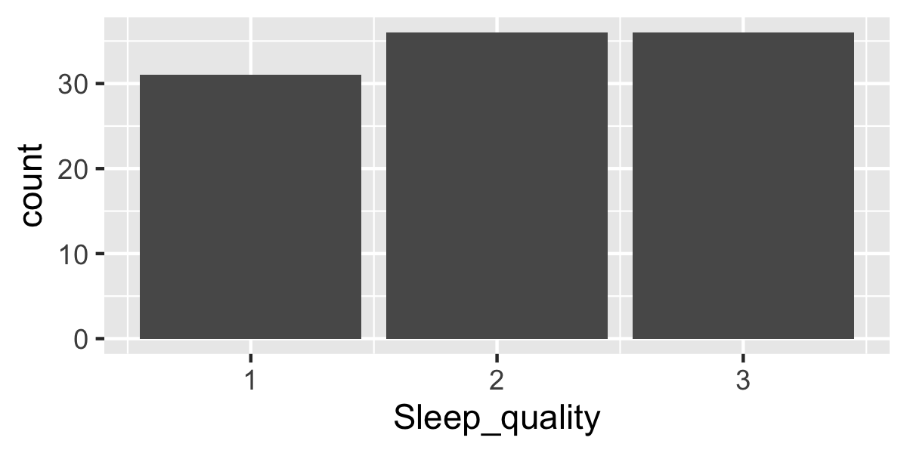
Because we want to plot a summary of the data (the mean) rather than the raw scores themselves, we have to use a stat.

```r
ggplot(data = exam_data, aes(x = Sleep_quality, y = Exam, fill = Gender))+
  geom_bar(stat = "summary", fun = "mean")
```

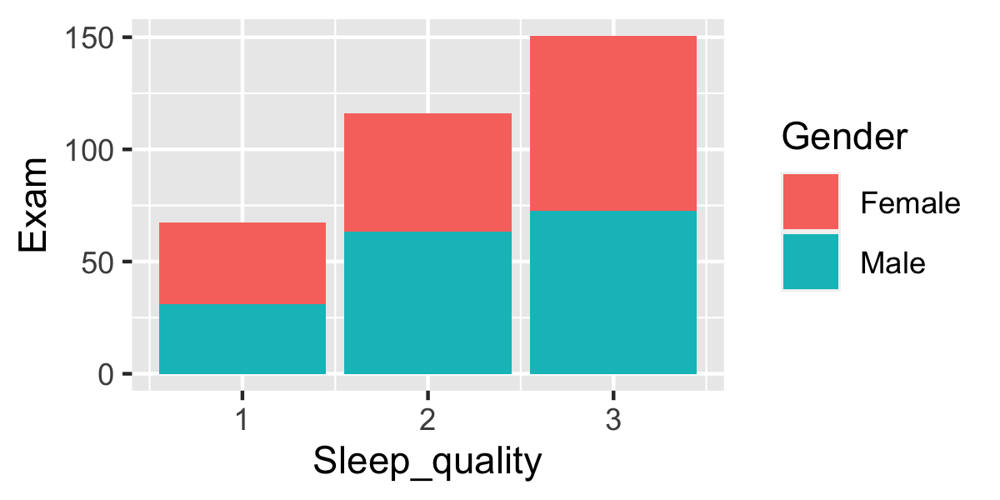

```r
ggplot(data = exam_data, aes(x = Sleep_quality, y = Exam, fill = Gender))+
  geom_bar(stat = "summary", fun = "mean", position = "dodge")
```

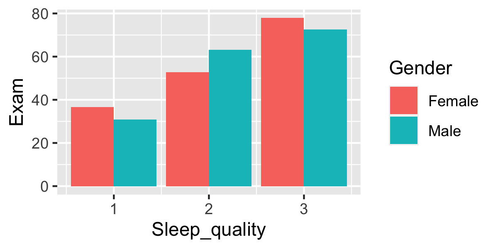

The other way to get the same plot that the code above gives, is using the stat_summary function that takes the following general form: `stat_summary(function = x, geom = y)`


```r
ggplot(data = exam_data, aes(x = Sleep_quality, y = Exam, fill = Gender))+
  stat_summary(fun = mean, geom = "bar", position = "dodge")
```


How to combine multiple plots? How to combine multiple plots? We can use the `patchwork` package. A nice tutorial on using this package can be found [here](https://patchwork.data-imaginist.com/articles/patchwork.html)


<div class="figure" style="text-align: center">

<p class="caption">Artwork by Allison Horst: https://github.com/allisonhorst/stats-illustrations</p>
</div>


```r
p1 = My_graph + geom_point(aes(color = Gender)) + geom_smooth()

p2 = ggplot(data = exam_data, aes(x = Anxiety)) + geom_histogram(bins = 31)

p3 = ggplot(data = exam_data, aes(x = Sleep_quality, y = Exam, fill = Gender))+
  stat_summary(fun = mean, geom = "bar", position = "dodge")

p4 = My_graph + geom_point() + geom_smooth(se = F, method = lm) +
  labs(x = "Exam scores %", y = "Anxiety scores")

combined = p1 + p2+ p3 + p4 + plot_layout(nrow = 4, byrow = F)

combined
```

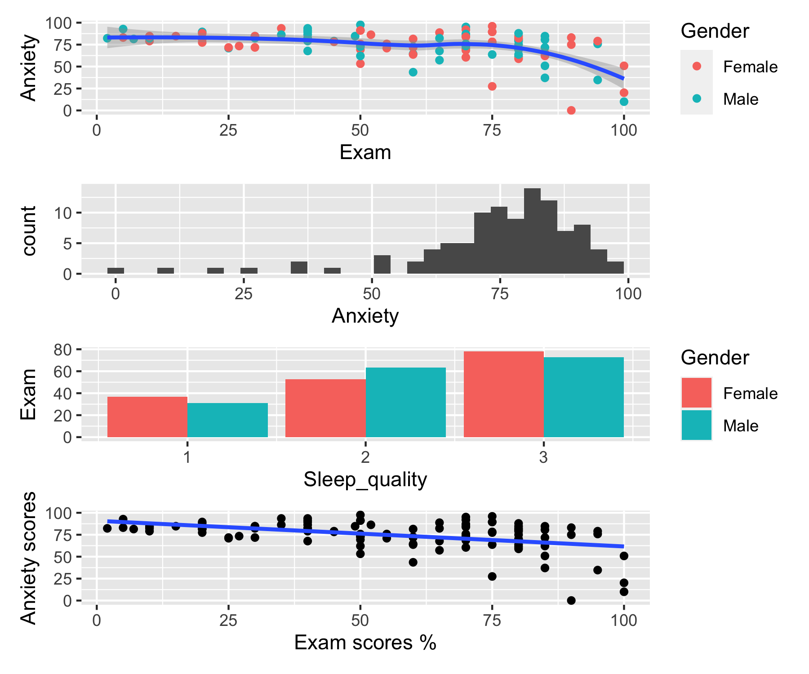

```r
p1 | p2 / p3 / p4
```

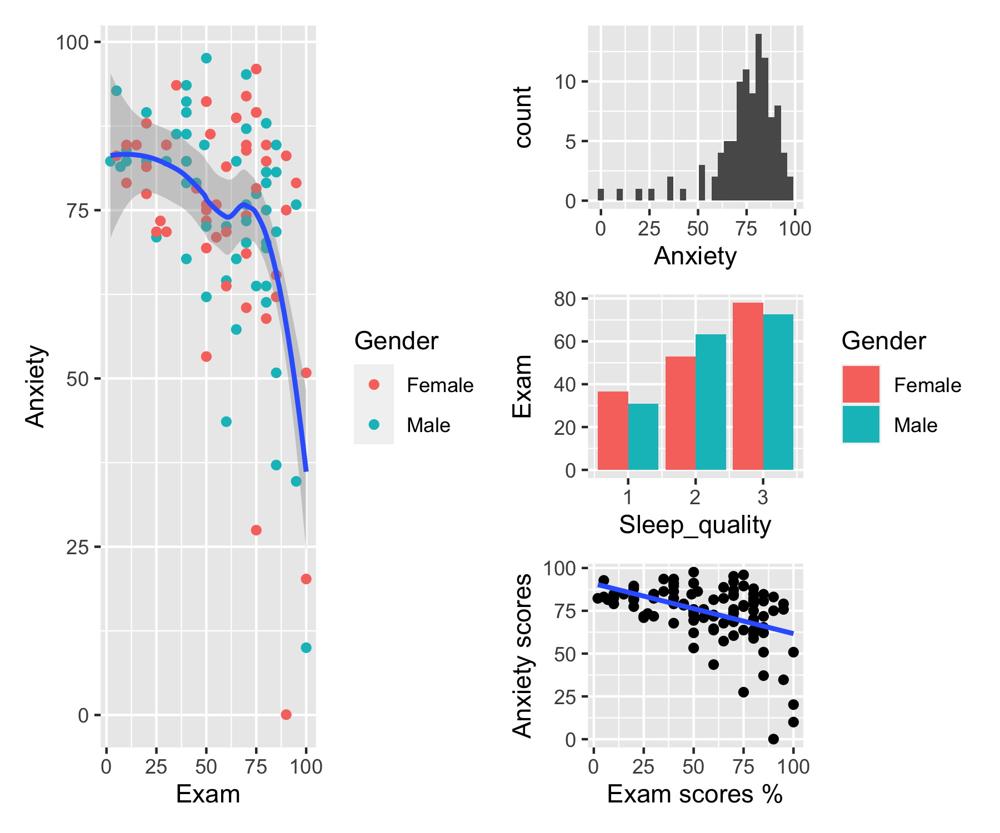

```r
p1 | p2 / (p3 / p4)
```

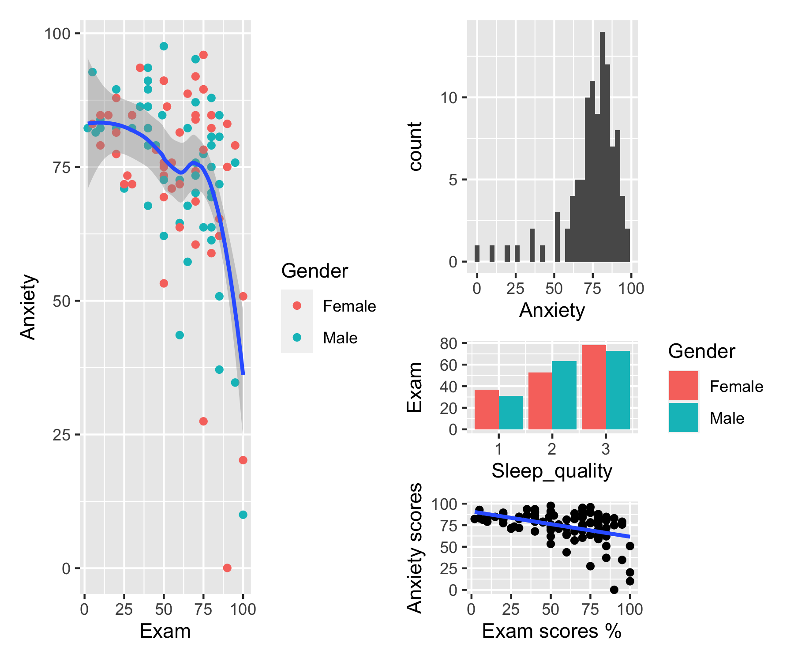


`ggsave()` function, which is a versatile exporting function that can export as PostScript (.eps/.ps), tex (pictex), pdf, jpeg, tiff, png, bmp, svg and wmf (in Windows only). In its basic form, the structure of the function is very simple: `ggsave(filename)`


```r
ggsave(combined, filename = here("outputs", "combined.png"), dpi=300)
```


Now that we learned the basics of ggplot, let's draw some plot for our experiment data. First, we need to create a dataset with aggregated `depression_score` scores over `group` and `stage`. We will use this dataset for line and bar graphs.


```r
library(ggsci)

data_exp1_orig <- read_csv(here("cleaned_data","cleaned_data_exp1.csv"))

data_exp1 <- data_exp1_orig%>% 
  #mutate_if(is.character, factor) %>%
  mutate(subject= factor(subject), # convert all characters to factor
         group = factor(group),
         stage = factor(stage))


aggregated_data_exp1 <- data_exp1 %>%
  group_by(stage, group) %>%
  mutate(depression_score = mean(depression_score)) %>%
  ungroup()


barplot_exp1 <- aggregated_data_exp1 %>%
  ggplot(aes(x=stage, y= depression_score, fill=group)) +
  geom_bar(stat = "identity", position= "dodge")+
  labs (x= '', y= "Depression Score") + 
  theme_bw() + 
  scale_fill_jama() 

#ggsave(barplot_exp1, filename = here("outputs","barplot_exp1.png"), dpi=300)


barplot_facet_exp1 <- aggregated_data_exp1 %>%
  ggplot(aes(x=group, y= depression_score, fill=stage)) +
  geom_bar(stat = "identity", position= "dodge")+
  labs (x= '', y= "Depression Score") + 
  theme_bw() + 
  theme(legend.position = "none",
        axis.text=element_text(size=11),
        axis.title = element_text(size = 12)) +
  facet_wrap(~stage, nrow = 1)+
  scale_fill_jco() 

#ggsave(barplot_facet_exp1, filename = here("outputs","barplot_facet_exp1.png"), dpi=300)


lineplot_exp1 <- aggregated_data_exp1 %>%
  ggplot(aes(x=factor(stage), y= depression_score, group= group, color= group)) +
  geom_line(aes(linetype= group)) +
  geom_point(size= 5)+
  labs (x= '', y= "Depression Score") + 
  theme_classic() +
  theme(legend.position = "bottom",
        axis.text=element_text(size=11),
        axis.title = element_text(size = 12)) +
  scale_color_nejm() 

#ggsave(lineplot_exp1, filename = here("outputs","lineplot_exp1.png"), dpi=300)


violinplot_exp1 <- data_exp1 %>%
  ggplot(aes(x=factor(stage), y= depression_score, fill= group)) +
  geom_violin()+
  labs (x= '', y= "Depression Score") + 
  theme_bw() + 
  theme(legend.position = "bottom",
        axis.text=element_text(size=11)) +
  scale_fill_d3() 

#ggsave(violinplot_exp1, filename = here("outputs","violinplot_exp1.png"), dpi=300)


boxplot_exp1 <- data_exp1 %>%
  ggplot(aes(x=factor(stage), y= depression_score, fill= group)) +
  geom_boxplot()+
  #geom_point(position = position_dodge(width=0.75), alpha= .5)+
  labs (x= '', y= "Depression Score") + 
  theme_bw() + 
  theme(legend.position = "bottom",
        axis.text=element_text(size=11)) +
  scale_fill_simpsons() 

#ggsave(boxplot_exp1, filename = here("outputs","boxplot_exp1.png"), dpi=300)


boxplot_facet_exp1 <- data_exp1 %>%
  ggplot(aes(x=factor(stage), y= depression_score, fill= group)) +
  geom_boxplot()+
  labs (x= '', y= "Depression Score") + 
  theme_bw() + 
  theme(legend.position = "bottom",
        axis.text=element_text(size=11),
        axis.text.x = element_text(angle = 90, vjust = 0.5, hjust=1)) +
  facet_wrap(~group)+
  scale_color_simpsons() 

#ggsave(boxplot_facet_exp1, filename = here("outputs","boxplot_facet_exp1.png"), dpi=300)
```

Let's combine our plots:


```r
combined_plot_exp1 <- barplot_facet_exp1 / (lineplot_exp1+violinplot_exp1+boxplot_exp1)
combined_plot_exp1
```

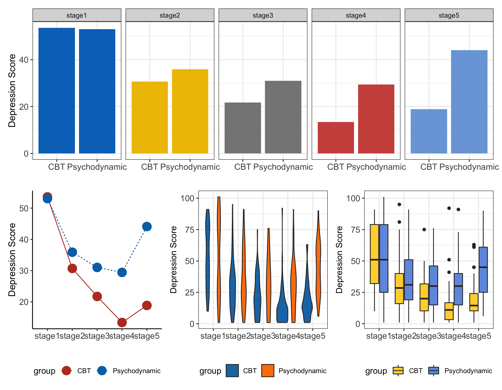

And here, we save our plots to the `outputs` folder.
```{rmessage=F}
ggsave(combined_plot_exp1, filename = here("outputs","combined_plot_exp1.png"), dpi=300, width = 12)
```


# Descriptive Statistics

<div class="figure" style="text-align: center">

<p class="caption">Artwork by Allison Horst: https://github.com/allisonhorst/stats-illustrations</p>
</div>

Now, let's do some descriptive statistics. Now, we can open a new script called `data_analysis.r` and read some datasets. Then we use `skimr` package to describe our data.


```r
narcissism_data <- read_csv(here("cleaned_data","narcissism_data.csv"))
narcissism_data %>% skimr::skim()
```


<table style='width: auto;'
        class='table table-condensed'>
<caption>Data summary</caption>
 <thead>
  <tr>
   <th style="text-align:left;">   </th>
   <th style="text-align:left;">   </th>
  </tr>
 </thead>
<tbody>
  <tr>
   <td style="text-align:left;"> Name </td>
   <td style="text-align:left;"> Piped data </td>
  </tr>
  <tr>
   <td style="text-align:left;"> Number of rows </td>
   <td style="text-align:left;"> 131 </td>
  </tr>
  <tr>
   <td style="text-align:left;"> Number of columns </td>
   <td style="text-align:left;"> 5 </td>
  </tr>
  <tr>
   <td style="text-align:left;"> _______________________ </td>
   <td style="text-align:left;">  </td>
  </tr>
  <tr>
   <td style="text-align:left;"> Column type frequency: </td>
   <td style="text-align:left;">  </td>
  </tr>
  <tr>
   <td style="text-align:left;"> character </td>
   <td style="text-align:left;"> 1 </td>
  </tr>
  <tr>
   <td style="text-align:left;"> numeric </td>
   <td style="text-align:left;"> 4 </td>
  </tr>
  <tr>
   <td style="text-align:left;"> ________________________ </td>
   <td style="text-align:left;">  </td>
  </tr>
  <tr>
   <td style="text-align:left;"> Group variables </td>
   <td style="text-align:left;"> None </td>
  </tr>
</tbody>
</table>


**Variable type: character**

<table>
 <thead>
  <tr>
   <th style="text-align:left;"> skim_variable </th>
   <th style="text-align:right;"> n_missing </th>
   <th style="text-align:right;"> complete_rate </th>
   <th style="text-align:right;"> min </th>
   <th style="text-align:right;"> max </th>
   <th style="text-align:right;"> empty </th>
   <th style="text-align:right;"> n_unique </th>
   <th style="text-align:right;"> whitespace </th>
  </tr>
 </thead>
<tbody>
  <tr>
   <td style="text-align:left;"> subject </td>
   <td style="text-align:right;"> 0 </td>
   <td style="text-align:right;"> 1 </td>
   <td style="text-align:right;"> 5 </td>
   <td style="text-align:right;"> 7 </td>
   <td style="text-align:right;"> 0 </td>
   <td style="text-align:right;"> 131 </td>
   <td style="text-align:right;"> 0 </td>
  </tr>
</tbody>
</table>


**Variable type: numeric**

<table>
 <thead>
  <tr>
   <th style="text-align:left;"> skim_variable </th>
   <th style="text-align:right;"> n_missing </th>
   <th style="text-align:right;"> complete_rate </th>
   <th style="text-align:right;"> mean </th>
   <th style="text-align:right;"> sd </th>
   <th style="text-align:right;"> p0 </th>
   <th style="text-align:right;"> p25 </th>
   <th style="text-align:right;"> p50 </th>
   <th style="text-align:right;"> p75 </th>
   <th style="text-align:right;"> p100 </th>
   <th style="text-align:left;"> hist </th>
  </tr>
 </thead>
<tbody>
  <tr>
   <td style="text-align:left;"> psychopathy </td>
   <td style="text-align:right;"> 0 </td>
   <td style="text-align:right;"> 1 </td>
   <td style="text-align:right;"> 8.78 </td>
   <td style="text-align:right;"> 2.27 </td>
   <td style="text-align:right;"> 0 </td>
   <td style="text-align:right;"> 8.0 </td>
   <td style="text-align:right;"> 10 </td>
   <td style="text-align:right;"> 10 </td>
   <td style="text-align:right;"> 11 </td>
   <td style="text-align:left;"> ▁▁▁▂▇ </td>
  </tr>
  <tr>
   <td style="text-align:left;"> self_esteem </td>
   <td style="text-align:right;"> 0 </td>
   <td style="text-align:right;"> 1 </td>
   <td style="text-align:right;"> 8.45 </td>
   <td style="text-align:right;"> 1.68 </td>
   <td style="text-align:right;"> 4 </td>
   <td style="text-align:right;"> 8.0 </td>
   <td style="text-align:right;"> 8 </td>
   <td style="text-align:right;"> 9 </td>
   <td style="text-align:right;"> 12 </td>
   <td style="text-align:left;"> ▁▅▇▆▃ </td>
  </tr>
  <tr>
   <td style="text-align:left;"> narcissism </td>
   <td style="text-align:right;"> 0 </td>
   <td style="text-align:right;"> 1 </td>
   <td style="text-align:right;"> 38.20 </td>
   <td style="text-align:right;"> 6.15 </td>
   <td style="text-align:right;"> 19 </td>
   <td style="text-align:right;"> 33.5 </td>
   <td style="text-align:right;"> 39 </td>
   <td style="text-align:right;"> 43 </td>
   <td style="text-align:right;"> 48 </td>
   <td style="text-align:left;"> ▁▂▇▇▆ </td>
  </tr>
  <tr>
   <td style="text-align:left;"> mental_health </td>
   <td style="text-align:right;"> 0 </td>
   <td style="text-align:right;"> 1 </td>
   <td style="text-align:right;"> 3.19 </td>
   <td style="text-align:right;"> 1.04 </td>
   <td style="text-align:right;"> 1 </td>
   <td style="text-align:right;"> 3.0 </td>
   <td style="text-align:right;"> 4 </td>
   <td style="text-align:right;"> 4 </td>
   <td style="text-align:right;"> 4 </td>
   <td style="text-align:left;"> ▂▂▁▃▇ </td>
  </tr>
</tbody>
</table>

* *Exercise*: Open the dataset called `treatment_data.csv` and do a descriptive analysis:

```r
treatment_data <- read_csv(here("cleaned_data","treatment_data.csv"))
treatment_data %>% skimr::skim()
```


<table style='width: auto;'
        class='table table-condensed'>
<caption>Data summary</caption>
 <thead>
  <tr>
   <th style="text-align:left;">   </th>
   <th style="text-align:left;">   </th>
  </tr>
 </thead>
<tbody>
  <tr>
   <td style="text-align:left;"> Name </td>
   <td style="text-align:left;"> Piped data </td>
  </tr>
  <tr>
   <td style="text-align:left;"> Number of rows </td>
   <td style="text-align:left;"> 131 </td>
  </tr>
  <tr>
   <td style="text-align:left;"> Number of columns </td>
   <td style="text-align:left;"> 7 </td>
  </tr>
  <tr>
   <td style="text-align:left;"> _______________________ </td>
   <td style="text-align:left;">  </td>
  </tr>
  <tr>
   <td style="text-align:left;"> Column type frequency: </td>
   <td style="text-align:left;">  </td>
  </tr>
  <tr>
   <td style="text-align:left;"> character </td>
   <td style="text-align:left;"> 3 </td>
  </tr>
  <tr>
   <td style="text-align:left;"> numeric </td>
   <td style="text-align:left;"> 4 </td>
  </tr>
  <tr>
   <td style="text-align:left;"> ________________________ </td>
   <td style="text-align:left;">  </td>
  </tr>
  <tr>
   <td style="text-align:left;"> Group variables </td>
   <td style="text-align:left;"> None </td>
  </tr>
</tbody>
</table>


**Variable type: character**

<table>
 <thead>
  <tr>
   <th style="text-align:left;"> skim_variable </th>
   <th style="text-align:right;"> n_missing </th>
   <th style="text-align:right;"> complete_rate </th>
   <th style="text-align:right;"> min </th>
   <th style="text-align:right;"> max </th>
   <th style="text-align:right;"> empty </th>
   <th style="text-align:right;"> n_unique </th>
   <th style="text-align:right;"> whitespace </th>
  </tr>
 </thead>
<tbody>
  <tr>
   <td style="text-align:left;"> subject </td>
   <td style="text-align:right;"> 0 </td>
   <td style="text-align:right;"> 1 </td>
   <td style="text-align:right;"> 5 </td>
   <td style="text-align:right;"> 7 </td>
   <td style="text-align:right;"> 0 </td>
   <td style="text-align:right;"> 131 </td>
   <td style="text-align:right;"> 0 </td>
  </tr>
  <tr>
   <td style="text-align:left;"> gender </td>
   <td style="text-align:right;"> 0 </td>
   <td style="text-align:right;"> 1 </td>
   <td style="text-align:right;"> 4 </td>
   <td style="text-align:right;"> 6 </td>
   <td style="text-align:right;"> 0 </td>
   <td style="text-align:right;"> 2 </td>
   <td style="text-align:right;"> 0 </td>
  </tr>
  <tr>
   <td style="text-align:left;"> treatment </td>
   <td style="text-align:right;"> 0 </td>
   <td style="text-align:right;"> 1 </td>
   <td style="text-align:right;"> 3 </td>
   <td style="text-align:right;"> 13 </td>
   <td style="text-align:right;"> 0 </td>
   <td style="text-align:right;"> 2 </td>
   <td style="text-align:right;"> 0 </td>
  </tr>
</tbody>
</table>


**Variable type: numeric**

<table>
 <thead>
  <tr>
   <th style="text-align:left;"> skim_variable </th>
   <th style="text-align:right;"> n_missing </th>
   <th style="text-align:right;"> complete_rate </th>
   <th style="text-align:right;"> mean </th>
   <th style="text-align:right;"> sd </th>
   <th style="text-align:right;"> p0 </th>
   <th style="text-align:right;"> p25 </th>
   <th style="text-align:right;"> p50 </th>
   <th style="text-align:right;"> p75 </th>
   <th style="text-align:right;"> p100 </th>
   <th style="text-align:left;"> hist </th>
  </tr>
 </thead>
<tbody>
  <tr>
   <td style="text-align:left;"> age </td>
   <td style="text-align:right;"> 0 </td>
   <td style="text-align:right;"> 1 </td>
   <td style="text-align:right;"> 21.15 </td>
   <td style="text-align:right;"> 6.52 </td>
   <td style="text-align:right;"> 16 </td>
   <td style="text-align:right;"> 18.0 </td>
   <td style="text-align:right;"> 19 </td>
   <td style="text-align:right;"> 20.0 </td>
   <td style="text-align:right;"> 63 </td>
   <td style="text-align:left;"> ▇▁▁▁▁ </td>
  </tr>
  <tr>
   <td style="text-align:left;"> anxiety </td>
   <td style="text-align:right;"> 0 </td>
   <td style="text-align:right;"> 1 </td>
   <td style="text-align:right;"> 62.35 </td>
   <td style="text-align:right;"> 24.51 </td>
   <td style="text-align:right;"> 0 </td>
   <td style="text-align:right;"> 40.0 </td>
   <td style="text-align:right;"> 69 </td>
   <td style="text-align:right;"> 81.0 </td>
   <td style="text-align:right;"> 100 </td>
   <td style="text-align:left;"> ▂▆▃▇▆ </td>
  </tr>
  <tr>
   <td style="text-align:left;"> depression </td>
   <td style="text-align:right;"> 0 </td>
   <td style="text-align:right;"> 1 </td>
   <td style="text-align:right;"> 52.50 </td>
   <td style="text-align:right;"> 22.12 </td>
   <td style="text-align:right;"> 0 </td>
   <td style="text-align:right;"> 34.5 </td>
   <td style="text-align:right;"> 51 </td>
   <td style="text-align:right;"> 71.0 </td>
   <td style="text-align:right;"> 100 </td>
   <td style="text-align:left;"> ▂▇▇▆▃ </td>
  </tr>
  <tr>
   <td style="text-align:left;"> life_satisfaction </td>
   <td style="text-align:right;"> 0 </td>
   <td style="text-align:right;"> 1 </td>
   <td style="text-align:right;"> 41.02 </td>
   <td style="text-align:right;"> 23.93 </td>
   <td style="text-align:right;"> 0 </td>
   <td style="text-align:right;"> 21.0 </td>
   <td style="text-align:right;"> 39 </td>
   <td style="text-align:right;"> 56.5 </td>
   <td style="text-align:right;"> 100 </td>
   <td style="text-align:left;"> ▅▇▅▃▂ </td>
  </tr>
</tbody>
</table>

* *Exercise*: Do the same thing for the `memory_data.csv`.


```r
memory_data <- read_csv(here("cleaned_data","memory_data.csv"))
memory_data %>% group_by(time) %>%
  skimr::skim()
```


<table style='width: auto;'
        class='table table-condensed'>
<caption>Data summary</caption>
 <thead>
  <tr>
   <th style="text-align:left;">   </th>
   <th style="text-align:left;">   </th>
  </tr>
 </thead>
<tbody>
  <tr>
   <td style="text-align:left;"> Name </td>
   <td style="text-align:left;"> Piped data </td>
  </tr>
  <tr>
   <td style="text-align:left;"> Number of rows </td>
   <td style="text-align:left;"> 262 </td>
  </tr>
  <tr>
   <td style="text-align:left;"> Number of columns </td>
   <td style="text-align:left;"> 5 </td>
  </tr>
  <tr>
   <td style="text-align:left;"> _______________________ </td>
   <td style="text-align:left;">  </td>
  </tr>
  <tr>
   <td style="text-align:left;"> Column type frequency: </td>
   <td style="text-align:left;">  </td>
  </tr>
  <tr>
   <td style="text-align:left;"> character </td>
   <td style="text-align:left;"> 2 </td>
  </tr>
  <tr>
   <td style="text-align:left;"> numeric </td>
   <td style="text-align:left;"> 2 </td>
  </tr>
  <tr>
   <td style="text-align:left;"> ________________________ </td>
   <td style="text-align:left;">  </td>
  </tr>
  <tr>
   <td style="text-align:left;"> Group variables </td>
   <td style="text-align:left;"> time </td>
  </tr>
</tbody>
</table>


**Variable type: character**

<table>
 <thead>
  <tr>
   <th style="text-align:left;"> skim_variable </th>
   <th style="text-align:left;"> time </th>
   <th style="text-align:right;"> n_missing </th>
   <th style="text-align:right;"> complete_rate </th>
   <th style="text-align:right;"> min </th>
   <th style="text-align:right;"> max </th>
   <th style="text-align:right;"> empty </th>
   <th style="text-align:right;"> n_unique </th>
   <th style="text-align:right;"> whitespace </th>
  </tr>
 </thead>
<tbody>
  <tr>
   <td style="text-align:left;"> subject </td>
   <td style="text-align:left;"> post_test_memory </td>
   <td style="text-align:right;"> 0 </td>
   <td style="text-align:right;"> 1 </td>
   <td style="text-align:right;"> 5 </td>
   <td style="text-align:right;"> 7 </td>
   <td style="text-align:right;"> 0 </td>
   <td style="text-align:right;"> 131 </td>
   <td style="text-align:right;"> 0 </td>
  </tr>
  <tr>
   <td style="text-align:left;"> subject </td>
   <td style="text-align:left;"> pre_test_memory </td>
   <td style="text-align:right;"> 0 </td>
   <td style="text-align:right;"> 1 </td>
   <td style="text-align:right;"> 5 </td>
   <td style="text-align:right;"> 7 </td>
   <td style="text-align:right;"> 0 </td>
   <td style="text-align:right;"> 131 </td>
   <td style="text-align:right;"> 0 </td>
  </tr>
  <tr>
   <td style="text-align:left;"> gender </td>
   <td style="text-align:left;"> post_test_memory </td>
   <td style="text-align:right;"> 0 </td>
   <td style="text-align:right;"> 1 </td>
   <td style="text-align:right;"> 4 </td>
   <td style="text-align:right;"> 6 </td>
   <td style="text-align:right;"> 0 </td>
   <td style="text-align:right;"> 2 </td>
   <td style="text-align:right;"> 0 </td>
  </tr>
  <tr>
   <td style="text-align:left;"> gender </td>
   <td style="text-align:left;"> pre_test_memory </td>
   <td style="text-align:right;"> 0 </td>
   <td style="text-align:right;"> 1 </td>
   <td style="text-align:right;"> 4 </td>
   <td style="text-align:right;"> 6 </td>
   <td style="text-align:right;"> 0 </td>
   <td style="text-align:right;"> 2 </td>
   <td style="text-align:right;"> 0 </td>
  </tr>
</tbody>
</table>


**Variable type: numeric**

<table>
 <thead>
  <tr>
   <th style="text-align:left;"> skim_variable </th>
   <th style="text-align:left;"> time </th>
   <th style="text-align:right;"> n_missing </th>
   <th style="text-align:right;"> complete_rate </th>
   <th style="text-align:right;"> mean </th>
   <th style="text-align:right;"> sd </th>
   <th style="text-align:right;"> p0 </th>
   <th style="text-align:right;"> p25 </th>
   <th style="text-align:right;"> p50 </th>
   <th style="text-align:right;"> p75 </th>
   <th style="text-align:right;"> p100 </th>
   <th style="text-align:left;"> hist </th>
  </tr>
 </thead>
<tbody>
  <tr>
   <td style="text-align:left;"> age </td>
   <td style="text-align:left;"> post_test_memory </td>
   <td style="text-align:right;"> 0 </td>
   <td style="text-align:right;"> 1 </td>
   <td style="text-align:right;"> 21.15 </td>
   <td style="text-align:right;"> 6.52 </td>
   <td style="text-align:right;"> 16 </td>
   <td style="text-align:right;"> 18.0 </td>
   <td style="text-align:right;"> 19 </td>
   <td style="text-align:right;"> 20.0 </td>
   <td style="text-align:right;"> 63 </td>
   <td style="text-align:left;"> ▇▁▁▁▁ </td>
  </tr>
  <tr>
   <td style="text-align:left;"> age </td>
   <td style="text-align:left;"> pre_test_memory </td>
   <td style="text-align:right;"> 0 </td>
   <td style="text-align:right;"> 1 </td>
   <td style="text-align:right;"> 21.15 </td>
   <td style="text-align:right;"> 6.52 </td>
   <td style="text-align:right;"> 16 </td>
   <td style="text-align:right;"> 18.0 </td>
   <td style="text-align:right;"> 19 </td>
   <td style="text-align:right;"> 20.0 </td>
   <td style="text-align:right;"> 63 </td>
   <td style="text-align:left;"> ▇▁▁▁▁ </td>
  </tr>
  <tr>
   <td style="text-align:left;"> memory_score </td>
   <td style="text-align:left;"> post_test_memory </td>
   <td style="text-align:right;"> 0 </td>
   <td style="text-align:right;"> 1 </td>
   <td style="text-align:right;"> 52.50 </td>
   <td style="text-align:right;"> 22.12 </td>
   <td style="text-align:right;"> 0 </td>
   <td style="text-align:right;"> 34.5 </td>
   <td style="text-align:right;"> 51 </td>
   <td style="text-align:right;"> 71.0 </td>
   <td style="text-align:right;"> 100 </td>
   <td style="text-align:left;"> ▂▇▇▆▃ </td>
  </tr>
  <tr>
   <td style="text-align:left;"> memory_score </td>
   <td style="text-align:left;"> pre_test_memory </td>
   <td style="text-align:right;"> 0 </td>
   <td style="text-align:right;"> 1 </td>
   <td style="text-align:right;"> 41.02 </td>
   <td style="text-align:right;"> 23.93 </td>
   <td style="text-align:right;"> 0 </td>
   <td style="text-align:right;"> 21.0 </td>
   <td style="text-align:right;"> 39 </td>
   <td style="text-align:right;"> 56.5 </td>
   <td style="text-align:right;"> 100 </td>
   <td style="text-align:left;"> ▅▇▅▃▂ </td>
  </tr>
</tbody>
</table>

Now, let's describe our experiment data:


```r
data_exp1_orig <- read_csv(here("cleaned_data","cleaned_data_exp1.csv"))
```

How many participants in total?


```r
data_exp1 %>% summarise(n= n_distinct(subject))
```

<div class="kable-table">

<table>
 <thead>
  <tr>
   <th style="text-align:right;"> n </th>
  </tr>
 </thead>
<tbody>
  <tr>
   <td style="text-align:right;"> 131 </td>
  </tr>
</tbody>
</table>

</div>


How many participants do we have in each group?

```r
data_exp1 %>% 
  group_by(subject) %>% 
  filter(row_number()==1) %>% 
  ungroup () %>% 
  group_by(group) %>% 
  count() 
```

<table class="table table-striped table-bordered table-condensed" style="margin-left: auto; margin-right: auto;">
 <thead>
  <tr>
   <th style="text-align:left;position: sticky; top:0; background-color: #FFFFFF;"> group </th>
   <th style="text-align:right;position: sticky; top:0; background-color: #FFFFFF;"> n </th>
  </tr>
 </thead>
<tbody>
  <tr>
   <td style="text-align:left;"> CBT </td>
   <td style="text-align:right;"> 66 </td>
  </tr>
  <tr>
   <td style="text-align:left;"> Psychodynamic </td>
   <td style="text-align:right;"> 65 </td>
  </tr>
</tbody>
</table>

Find the mean and sd for numeric variables using base R `summary` function:


```r
data_exp1 %>% 
  group_by(subject) %>% 
  filter(row_number()==1) %>% 
  ungroup () %>%
  summary()
```

```
##     subject         age           gender                    group   
##  subj1  :  1   Min.   :16.00   Length:131         CBT          :66  
##  subj10 :  1   1st Qu.:18.00   Class :character   Psychodynamic:65  
##  subj101:  1   Median :19.00   Mode  :character                     
##  subj102:  1   Mean   :21.15                                        
##  subj103:  1   3rd Qu.:20.00                                        
##  subj104:  1   Max.   :63.00                                        
##  (Other):125                                                        
##     stage     depression_score anxiety_total  sleep_quality   
##  stage1:131   Min.   :  1.00   Min.   :19.0   Min.   : 0.000  
##  stage2:  0   1st Qu.: 29.00   1st Qu.:33.5   1st Qu.: 8.000  
##  stage3:  0   Median : 51.00   Median :39.0   Median :10.000  
##  stage4:  0   Mean   : 53.33   Mean   :38.2   Mean   : 8.779  
##  stage5:  0   3rd Qu.: 79.00   3rd Qu.:43.0   3rd Qu.:10.000  
##               Max.   :101.00   Max.   :48.0   Max.   :11.000  
##                                                               
##  life_satisfaction
##  Min.   : 4.00    
##  1st Qu.: 8.00    
##  Median : 8.00    
##  Mean   : 8.45    
##  3rd Qu.: 9.00    
##  Max.   :12.00    
## 
```

Alternatively, we can use `skimr` library:

```r
data_exp1 %>% 
  group_by(subject) %>% 
  filter(row_number()==1) %>% 
  ungroup () %>% 
  dplyr::select (age, depression_score, anxiety_total, sleep_quality, life_satisfaction) %>% 
  skimr::skim()
```

<div style="border: 1px solid #ddd; padding: 5px; overflow-x: scroll; width:780px; "><table class="table table-striped table-bordered table-condensed" style="width: auto !important; margin-left: auto; margin-right: auto;">
 <thead>
  <tr>
   <th style="text-align:left;position: sticky; top:0; background-color: #FFFFFF;"> skim_type </th>
   <th style="text-align:left;position: sticky; top:0; background-color: #FFFFFF;"> skim_variable </th>
   <th style="text-align:right;position: sticky; top:0; background-color: #FFFFFF;"> n_missing </th>
   <th style="text-align:right;position: sticky; top:0; background-color: #FFFFFF;"> complete_rate </th>
   <th style="text-align:right;position: sticky; top:0; background-color: #FFFFFF;"> numeric.mean </th>
   <th style="text-align:right;position: sticky; top:0; background-color: #FFFFFF;"> numeric.sd </th>
   <th style="text-align:right;position: sticky; top:0; background-color: #FFFFFF;"> numeric.p0 </th>
   <th style="text-align:right;position: sticky; top:0; background-color: #FFFFFF;"> numeric.p25 </th>
   <th style="text-align:right;position: sticky; top:0; background-color: #FFFFFF;"> numeric.p50 </th>
   <th style="text-align:right;position: sticky; top:0; background-color: #FFFFFF;"> numeric.p75 </th>
   <th style="text-align:right;position: sticky; top:0; background-color: #FFFFFF;"> numeric.p100 </th>
   <th style="text-align:left;position: sticky; top:0; background-color: #FFFFFF;"> numeric.hist </th>
  </tr>
 </thead>
<tbody>
  <tr>
   <td style="text-align:left;"> numeric </td>
   <td style="text-align:left;"> age </td>
   <td style="text-align:right;"> 0 </td>
   <td style="text-align:right;"> 1 </td>
   <td style="text-align:right;"> 21.152672 </td>
   <td style="text-align:right;"> 6.515630 </td>
   <td style="text-align:right;"> 16 </td>
   <td style="text-align:right;"> 18.0 </td>
   <td style="text-align:right;"> 19 </td>
   <td style="text-align:right;"> 20 </td>
   <td style="text-align:right;"> 63 </td>
   <td style="text-align:left;"> ▇▁▁▁▁ </td>
  </tr>
  <tr>
   <td style="text-align:left;"> numeric </td>
   <td style="text-align:left;"> depression_score </td>
   <td style="text-align:right;"> 0 </td>
   <td style="text-align:right;"> 1 </td>
   <td style="text-align:right;"> 53.328244 </td>
   <td style="text-align:right;"> 27.967685 </td>
   <td style="text-align:right;"> 1 </td>
   <td style="text-align:right;"> 29.0 </td>
   <td style="text-align:right;"> 51 </td>
   <td style="text-align:right;"> 79 </td>
   <td style="text-align:right;"> 101 </td>
   <td style="text-align:left;"> ▅▇▅▇▅ </td>
  </tr>
  <tr>
   <td style="text-align:left;"> numeric </td>
   <td style="text-align:left;"> anxiety_total </td>
   <td style="text-align:right;"> 0 </td>
   <td style="text-align:right;"> 1 </td>
   <td style="text-align:right;"> 38.198473 </td>
   <td style="text-align:right;"> 6.153698 </td>
   <td style="text-align:right;"> 19 </td>
   <td style="text-align:right;"> 33.5 </td>
   <td style="text-align:right;"> 39 </td>
   <td style="text-align:right;"> 43 </td>
   <td style="text-align:right;"> 48 </td>
   <td style="text-align:left;"> ▁▂▇▇▆ </td>
  </tr>
  <tr>
   <td style="text-align:left;"> numeric </td>
   <td style="text-align:left;"> sleep_quality </td>
   <td style="text-align:right;"> 0 </td>
   <td style="text-align:right;"> 1 </td>
   <td style="text-align:right;"> 8.778626 </td>
   <td style="text-align:right;"> 2.274576 </td>
   <td style="text-align:right;"> 0 </td>
   <td style="text-align:right;"> 8.0 </td>
   <td style="text-align:right;"> 10 </td>
   <td style="text-align:right;"> 10 </td>
   <td style="text-align:right;"> 11 </td>
   <td style="text-align:left;"> ▁▁▁▂▇ </td>
  </tr>
  <tr>
   <td style="text-align:left;"> numeric </td>
   <td style="text-align:left;"> life_satisfaction </td>
   <td style="text-align:right;"> 0 </td>
   <td style="text-align:right;"> 1 </td>
   <td style="text-align:right;"> 8.450382 </td>
   <td style="text-align:right;"> 1.683466 </td>
   <td style="text-align:right;"> 4 </td>
   <td style="text-align:right;"> 8.0 </td>
   <td style="text-align:right;"> 8 </td>
   <td style="text-align:right;"> 9 </td>
   <td style="text-align:right;"> 12 </td>
   <td style="text-align:left;"> ▁▅▇▆▃ </td>
  </tr>
</tbody>
</table></div>


* *Exercise*: For this exercise, we use a dataset of one of my own studies. In this study, we asked participants to guess the physical brightness of reasoning arguments and then we gave a cognitive ability test. (See the original study [here](https://osf.io/ebxnf/)). Open `ghasemi_brightness_exp4.csv` file and answer to the following questions:

1. How many participants did we test in total?
2. Find out how many male and female we tested.
3. Calculate mean and sd for age and cognitive ability (`cog_ability`).


```r
ghasemi_data <- read_csv(here("cleaned_data","ghasemi_brightness_exp4.csv"))

ghasemi_data %>% summarise(n = n_distinct(participant)) # number of participants:200
```

<div class="kable-table">

<table>
 <thead>
  <tr>
   <th style="text-align:right;"> n </th>
  </tr>
 </thead>
<tbody>
  <tr>
   <td style="text-align:right;"> 200 </td>
  </tr>
</tbody>
</table>

</div>

```r
ghasemi_data %>% group_by (participant) %>% filter (row_number()==1) %>% group_by (gender) %>% summarise(n= n()) %>% ungroup() # 183 female, 17 male
```

<div class="kable-table">

<table>
 <thead>
  <tr>
   <th style="text-align:left;"> gender </th>
   <th style="text-align:right;"> n </th>
  </tr>
 </thead>
<tbody>
  <tr>
   <td style="text-align:left;"> Female </td>
   <td style="text-align:right;"> 183 </td>
  </tr>
  <tr>
   <td style="text-align:left;"> Male </td>
   <td style="text-align:right;"> 17 </td>
  </tr>
</tbody>
</table>

</div>

```r
ghasemi_data %>% dplyr::select (age, cog_ability) %>% skimr::skim() # mean and sd for age and cognitive ability
```


<table style='width: auto;'
        class='table table-condensed'>
<caption>Data summary</caption>
 <thead>
  <tr>
   <th style="text-align:left;">   </th>
   <th style="text-align:left;">   </th>
  </tr>
 </thead>
<tbody>
  <tr>
   <td style="text-align:left;"> Name </td>
   <td style="text-align:left;"> Piped data </td>
  </tr>
  <tr>
   <td style="text-align:left;"> Number of rows </td>
   <td style="text-align:left;"> 38400 </td>
  </tr>
  <tr>
   <td style="text-align:left;"> Number of columns </td>
   <td style="text-align:left;"> 2 </td>
  </tr>
  <tr>
   <td style="text-align:left;"> _______________________ </td>
   <td style="text-align:left;">  </td>
  </tr>
  <tr>
   <td style="text-align:left;"> Column type frequency: </td>
   <td style="text-align:left;">  </td>
  </tr>
  <tr>
   <td style="text-align:left;"> numeric </td>
   <td style="text-align:left;"> 2 </td>
  </tr>
  <tr>
   <td style="text-align:left;"> ________________________ </td>
   <td style="text-align:left;">  </td>
  </tr>
  <tr>
   <td style="text-align:left;"> Group variables </td>
   <td style="text-align:left;"> None </td>
  </tr>
</tbody>
</table>


**Variable type: numeric**

<table>
 <thead>
  <tr>
   <th style="text-align:left;"> skim_variable </th>
   <th style="text-align:right;"> n_missing </th>
   <th style="text-align:right;"> complete_rate </th>
   <th style="text-align:right;"> mean </th>
   <th style="text-align:right;"> sd </th>
   <th style="text-align:right;"> p0 </th>
   <th style="text-align:right;"> p25 </th>
   <th style="text-align:right;"> p50 </th>
   <th style="text-align:right;"> p75 </th>
   <th style="text-align:right;"> p100 </th>
   <th style="text-align:left;"> hist </th>
  </tr>
 </thead>
<tbody>
  <tr>
   <td style="text-align:left;"> age </td>
   <td style="text-align:right;"> 0 </td>
   <td style="text-align:right;"> 1 </td>
   <td style="text-align:right;"> 22.20 </td>
   <td style="text-align:right;"> 6.78 </td>
   <td style="text-align:right;"> 17 </td>
   <td style="text-align:right;"> 19 </td>
   <td style="text-align:right;"> 20 </td>
   <td style="text-align:right;"> 22 </td>
   <td style="text-align:right;"> 52 </td>
   <td style="text-align:left;"> ▇▁▁▁▁ </td>
  </tr>
  <tr>
   <td style="text-align:left;"> cog_ability </td>
   <td style="text-align:right;"> 0 </td>
   <td style="text-align:right;"> 1 </td>
   <td style="text-align:right;"> 39.55 </td>
   <td style="text-align:right;"> 9.46 </td>
   <td style="text-align:right;"> 11 </td>
   <td style="text-align:right;"> 34 </td>
   <td style="text-align:right;"> 40 </td>
   <td style="text-align:right;"> 46 </td>
   <td style="text-align:right;"> 61 </td>
   <td style="text-align:left;"> ▁▃▇▆▂ </td>
  </tr>
</tbody>
</table>


# Data Analysis

## t-test

Now, we use the treatment data to run three different independent t-tests. Suppose we did an experiment to compare the effectiveness of CBT vs. Psychodynamic therapies in decreasing anxiety, and depression and also in improving life satisfaction:


```r
# t.test (indep)
t.test(anxiety~treatment, data= treatment_data)
```

```
## 
## 	Welch Two Sample t-test
## 
## data:  anxiety by treatment
## t = -0.85021, df = 124.18, p-value = 0.3968
## alternative hypothesis: true difference in means is not equal to 0
## 95 percent confidence interval:
##  -12.11096   4.83264
## sample estimates:
##           mean in group CBT mean in group Psychodynamic 
##                    60.54545                    64.18462
```

```r
t.test(depression~treatment, data= treatment_data)
```

```
## 
## 	Welch Two Sample t-test
## 
## data:  depression by treatment
## t = -2.8725, df = 123.97, p-value = 0.004792
## alternative hypothesis: true difference in means is not equal to 0
## 95 percent confidence interval:
##  -18.21965  -3.35424
## sample estimates:
##           mean in group CBT mean in group Psychodynamic 
##                    47.15152                    57.93846
```

```r
t.test(life_satisfaction~treatment, data= treatment_data)
```

```
## 
## 	Welch Two Sample t-test
## 
## data:  life_satisfaction by treatment
## t = -5.2688, df = 127.11, p-value = 0.0000005699
## alternative hypothesis: true difference in means is not equal to 0
## 95 percent confidence interval:
##  -27.61850 -12.53721
## sample estimates:
##           mean in group CBT mean in group Psychodynamic 
##                    31.06061                    51.13846
```

In another experiment, suppose we have created a method to boost memory. Then, we recruit some participants, do a memory pre-test, implement the method, and do a memory post-test, Now, we want to see whether our method have improved participants' memory: 


```r
# t.test (paired)
t.test(memory_score~time, data= memory_data, paired= T)
```

```
## 
## 	Paired t-test
## 
## data:  memory_score by time
## t = 5.4761, df = 130, p-value = 0.0000002163
## alternative hypothesis: true difference in means is not equal to 0
## 95 percent confidence interval:
##   7.333171 15.628661
## sample estimates:
## mean of the differences 
##                11.48092
```

Now that we learned about t-test, let's perform this test on our dataset. Is there a difference between groups at the first stage? Ideally, we want participants' depresion score at the first stage to be similar for both groups because we have not started our treatment yet. Previous graphs showed us that depression scores of the CBT and Psychodynamic groups at this stage are pretty close. Let's test that using an **independent t-test** (because we have 2 independent groups):


```r
# Is there a difference between groups at the first stage?
data_exp1 %>% 
  group_by(group) %>% 
  filter(stage=='stage1') %>% 
  ungroup () %>%
  t.test(depression_score~group, data = ., paired=FALSE)
```

```
## 
## 	Welch Two Sample t-test
## 
## data:  depression_score by group
## t = 0.10768, df = 118.92, p-value = 0.9144
## alternative hypothesis: true difference in means is not equal to 0
## 95 percent confidence interval:
##  -9.205588 10.264329
## sample estimates:
##           mean in group CBT mean in group Psychodynamic 
##                    53.59091                    53.06154
```

Now, we wonder if psychotherapy treatments were effective at all, regardless of the treatment method. So, we would like to test if depresion score at the forth stage are lower than scores at the stage 2? Since a pair of score at stage 2 and stage 4 is coming from a same person, we use **paired t-test**.


```r
# Is there a difference between ratings of stage2 and stage4?
data_exp1 %>% 
  filter(stage=='stage2' | stage=='stage4') %>% 
  ungroup () %>%
  t.test(depression_score~stage, data = ., paired=TRUE)
```

```
## 
## 	Paired t-test
## 
## data:  depression_score by stage
## t = 5.5931, df = 130, p-value = 0.0000001261
## alternative hypothesis: true difference in means is not equal to 0
## 95 percent confidence interval:
##   7.70108 16.13098
## sample estimates:
## mean of the differences 
##                11.91603
```


* *Exercise*: John et al. (2019) investigated the consequences of backing down (changing one's mind in lights of evidence)and how other people view someone who change their mind. In their second experiments, they presented participants either with a person who changes their mind or a person who refuses to back down. Then, they asked participants to rate how intelligent and confident the person is (See the original study [here](https://www.hbs.edu/faculty/Publication%20Files/John%20et%20al%20-%20self-presentational%20consequences_b85b2c43-a5b5-474c-9e2c-e9853b10727e.pdf)). They reported that: 

> "Relative to the entrepreneur who did not back down, participants judged the entrepreneur who backed down as more intelligent (M_backed_down=5.13 out of 7, SD=1.09; M_did_not_back_down=3.97, SD=1.54; t(271.12)=−7.59, p < .001) but less confident (M_backed_down=4.50 out of 7, SD=1.36; M_did_not_back_down=5.65, SD=1.10; t(291.01)=8.08, p < .001).".

Open the `john_backdown_exp2.csv` file and try to reproduce their results. Run two separate independent t-test, one with `intelligent` as the dependent variable and one with `confident` as the dependent variable. For both t-test, use `back_down` as the between-subject independent variable.


```r
john_data <- read_csv(here("cleaned_data","john_backdown_exp2.csv"))


t.test(intelligent~back_down, data = john_data, paired=FALSE)
```

```
## 
## 	Welch Two Sample t-test
## 
## data:  intelligent by back_down
## t = 7.5853, df = 271.12, p-value = 0.0000000000005319
## alternative hypothesis: true difference in means is not equal to 0
## 95 percent confidence interval:
##  0.8577107 1.4590076
## sample estimates:
##       mean in group backed_down mean in group did_not_back_down 
##                        5.129412                        3.971053
```

```r
t.test(confident~back_down, data = john_data, paired=FALSE)
```

```
## 
## 	Welch Two Sample t-test
## 
## data:  confident by back_down
## t = -8.0763, df = 291.01, p-value = 0.00000000000001787
## alternative hypothesis: true difference in means is not equal to 0
## 95 percent confidence interval:
##  -1.4257768 -0.8670294
## sample estimates:
##       mean in group backed_down mean in group did_not_back_down 
##                        4.503268                        5.649671
```


## Analysis of Variance (ANOVA)

Now, let's analysis our main experiment data: Do participants in the CBT group show better outcome compared to participants in the Psychodynamic group? Suppose we believe that participants should show lower depression after 5 or 10 sessions of both psychotherapy treatments and this decrease should be more pronounced for CBT than psychodynamic psychotherapy. If this is the case. we expect an interaction in the traditional **Analysis of Variance (AONVA)** test.


```r
aov_m1 <- aov_car (depression_score ~ group*stage +
                     Error(subject/stage), data = data_exp1)  
```

<table class="table table-striped table-bordered table-condensed" style="margin-left: auto; margin-right: auto;">
 <thead>
  <tr>
   <th style="text-align:left;position: sticky; top:0; background-color: #FFFFFF;"> Effect </th>
   <th style="text-align:left;position: sticky; top:0; background-color: #FFFFFF;"> df </th>
   <th style="text-align:left;position: sticky; top:0; background-color: #FFFFFF;"> MSE </th>
   <th style="text-align:left;position: sticky; top:0; background-color: #FFFFFF;"> F </th>
   <th style="text-align:left;position: sticky; top:0; background-color: #FFFFFF;"> ges </th>
   <th style="text-align:left;position: sticky; top:0; background-color: #FFFFFF;"> p.value </th>
  </tr>
 </thead>
<tbody>
  <tr>
   <td style="text-align:left;"> group </td>
   <td style="text-align:left;"> 1, 129 </td>
   <td style="text-align:left;"> 737.60 </td>
   <td style="text-align:left;"> 27.08 *** </td>
   <td style="text-align:left;"> .066 </td>
   <td style="text-align:left;"> &lt;.001 </td>
  </tr>
  <tr>
   <td style="text-align:left;"> stage </td>
   <td style="text-align:left;"> 2.97, 382.72 </td>
   <td style="text-align:left;"> 492.81 </td>
   <td style="text-align:left;"> 53.15 *** </td>
   <td style="text-align:left;"> .215 </td>
   <td style="text-align:left;"> &lt;.001 </td>
  </tr>
  <tr>
   <td style="text-align:left;"> group:stage </td>
   <td style="text-align:left;"> 2.97, 382.72 </td>
   <td style="text-align:left;"> 492.81 </td>
   <td style="text-align:left;"> 8.91 *** </td>
   <td style="text-align:left;"> .044 </td>
   <td style="text-align:left;"> &lt;.001 </td>
  </tr>
</tbody>
</table>

As you can see, we found a significant main effect of stage and a significant group by stage interaction. We can use the `emmeans` package to do post-hoc tests.


```r
# main effect of stage
emmeans(aov_m1, 'stage')
```

```
##  stage  emmean   SE  df lower.CL upper.CL
##  stage1   53.3 1.83 579     49.7     56.9
##  stage2   33.3 1.83 579     29.7     36.9
##  stage3   26.3 1.83 579     22.7     29.9
##  stage4   21.4 1.83 579     17.8     25.0
##  stage5   31.4 1.83 579     27.8     35.0
## 
## Results are averaged over the levels of: group 
## Warning: EMMs are biased unless design is perfectly balanced 
## Confidence level used: 0.95
```

```r
pairs(emmeans(aov_m1, 'stage'), adjust= 'holm')
```

```
##  contrast        estimate   SE  df t.ratio p.value
##  stage1 - stage2    20.03 2.36 516  8.480  <.0001 
##  stage1 - stage3    26.94 2.36 516 11.404  <.0001 
##  stage1 - stage4    31.91 2.36 516 13.506  <.0001 
##  stage1 - stage5    21.84 2.36 516  9.245  <.0001 
##  stage2 - stage3     6.91 2.36 516  2.924  0.0144 
##  stage2 - stage4    11.87 2.36 516  5.027  <.0001 
##  stage2 - stage5     1.81 2.36 516  0.766  0.4442 
##  stage3 - stage4     4.97 2.36 516  2.102  0.0941 
##  stage3 - stage5    -5.10 2.36 516 -2.158  0.0941 
##  stage4 - stage5   -10.07 2.36 516 -4.261  0.0001 
## 
## Results are averaged over the levels of: group 
## P value adjustment: holm method for 10 tests
```


```r
# group by stage interaction
emmeans(aov_m1, "group", by= "stage")
```

```
## stage = stage1:
##  group         emmean   SE  df lower.CL upper.CL
##  CBT             53.5 2.59 577    48.47     58.6
##  Psychodynamic   53.0 2.60 580    47.92     58.1
## 
## stage = stage2:
##  group         emmean   SE  df lower.CL upper.CL
##  CBT             30.7 2.59 577    25.58     35.7
##  Psychodynamic   35.9 2.60 580    30.75     41.0
## 
## stage = stage3:
##  group         emmean   SE  df lower.CL upper.CL
##  CBT             21.7 2.59 577    16.62     26.8
##  Psychodynamic   31.0 2.60 580    25.89     36.1
## 
## stage = stage4:
##  group         emmean   SE  df lower.CL upper.CL
##  CBT             13.4 2.59 577     8.29     18.4
##  Psychodynamic   29.4 2.60 580    24.29     34.5
## 
## stage = stage5:
##  group         emmean   SE  df lower.CL upper.CL
##  CBT             18.8 2.59 577    13.74     23.9
##  Psychodynamic   44.1 2.60 580    38.96     49.2
## 
## Warning: EMMs are biased unless design is perfectly balanced 
## Confidence level used: 0.95
```

```r
update(pairs(emmeans(aov_m1, "group", by= "stage")), by = NULL, adjust = "holm") 
```

```
##  contrast            stage  estimate   SE  df t.ratio p.value
##  CBT - Psychodynamic stage1    0.529 3.67 579  0.144  0.8852 
##  CBT - Psychodynamic stage2   -5.195 3.67 579 -1.417  0.3138 
##  CBT - Psychodynamic stage3   -9.288 3.67 579 -2.534  0.0346 
##  CBT - Psychodynamic stage4  -16.022 3.67 579 -4.371  0.0001 
##  CBT - Psychodynamic stage5  -25.244 3.67 579 -6.887  <.0001 
## 
## P value adjustment: holm method for 5 tests
```

You can use the `afex_plot` function from afex to create beautiful plots. Those plots interacts nicely with ggplot:

```r
afex_plot(aov_m1, x = "stage", trace = "group", error='between',
          line_arg = list(size=1),
          point_arg = list(size=3.5),
          data_arg = list(size= 1, color= 'grey', width=.4),
          data_geom = geom_boxplot,
          mapping = c("linetype", "shape", "fill"),
          legend_title = "Group") +
  labs(y = "Depression Score", x = "") +
  theme_bw()+ # remove the grey background and grid
  theme(axis.text=element_text(size=13),
        axis.title = element_text(size = 13),
        legend.text=element_text(size=13),
        legend.title=element_text(size=13),
        legend.position='bottom',
        legend.key.size = unit(1, "cm"),
        legend.background = element_rect(colour = 'black', fill = 'white', linetype='solid'))+
  scale_color_simpsons() +
  scale_fill_simpsons()
```

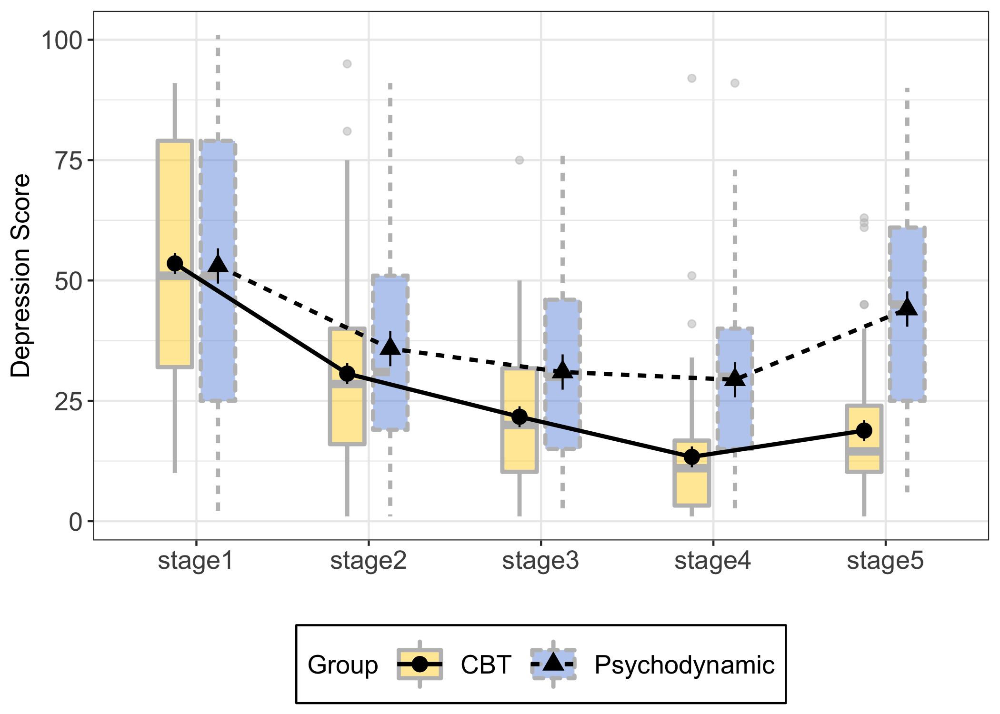


If you are interested in this topic, check out this nice tutorial about [using afex to run ANOVA](https://cran.r-project.org/web/packages/afex/vignettes/afex_anova_example.html), and also this interesting tutorial on the [emmeans package](https://aosmith.rbind.io/2019/03/25/getting-started-with-emmeans/).

* *Exercise*: Rotello et al. (2018) investigated the association between the race (White vs. Black faces) and the gun-tool judgments. In their first experiments, they presented participants with 16 White male faces and 16 Black male faces, and following that 8 images of guns and 8 images of tools. They asked participants to judge if the object is a tool or a gun by pressing keyboard buttons. Then, they ran an ANOVA to see if participants' gun responses are higher for any of the races. So, they included prime race (Black, White) and target identity (gun, tool) as independent variables and participants' gun responses as dependent variable into their linear model (See the original study [here](https://online.ucpress.edu/collabra/article/4/1/32/112986/The-Shape-of-ROC-Curves-in-Shooter-Tasks)). They found that: 

> "Participants made more gun responses to guns than to tools, F(1,45) = 53243, p < 0.0001, η2g = 0.998. However, the race of the prime face did not matter, F(1,45) = 0.287, p > 0.59, η2g = 0.001, nor was there an interaction of prime race with target object, F(1,45) = 0.022, p > 0.88, η2g = 0.000)".

Open the `rotello_shooter_exp1.csv` file and try to reproduce their results. Run an ANOVA (type III) with `resp` as the dependent variable and target, prime, and their interaction as independent variables.


```r
# load the general data file
rotello_data <- read_csv(here("cleaned_data","rotello_shooter_exp1.csv"))

# ANOVA
rotello_aov <- aov_car (resp ~ target*prime +
           Error(subject/target*prime), data = rotello_data)
```

<table class="table table-striped table-bordered table-condensed" style="margin-left: auto; margin-right: auto;">
 <thead>
  <tr>
   <th style="text-align:left;position: sticky; top:0; background-color: #FFFFFF;"> Effect </th>
   <th style="text-align:left;position: sticky; top:0; background-color: #FFFFFF;"> df </th>
   <th style="text-align:left;position: sticky; top:0; background-color: #FFFFFF;"> MSE </th>
   <th style="text-align:left;position: sticky; top:0; background-color: #FFFFFF;"> F </th>
   <th style="text-align:left;position: sticky; top:0; background-color: #FFFFFF;"> ges </th>
   <th style="text-align:left;position: sticky; top:0; background-color: #FFFFFF;"> p.value </th>
  </tr>
 </thead>
<tbody>
  <tr>
   <td style="text-align:left;"> target </td>
   <td style="text-align:left;"> 1, 45 </td>
   <td style="text-align:left;"> 0.00 </td>
   <td style="text-align:left;"> 53242.99 *** </td>
   <td style="text-align:left;"> .998 </td>
   <td style="text-align:left;"> &lt;.001 </td>
  </tr>
  <tr>
   <td style="text-align:left;"> prime </td>
   <td style="text-align:left;"> 1, 45 </td>
   <td style="text-align:left;"> 0.00 </td>
   <td style="text-align:left;"> 0.29 </td>
   <td style="text-align:left;"> .001 </td>
   <td style="text-align:left;"> .595 </td>
  </tr>
  <tr>
   <td style="text-align:left;"> target:prime </td>
   <td style="text-align:left;"> 1, 45 </td>
   <td style="text-align:left;"> 0.00 </td>
   <td style="text-align:left;"> 0.02 </td>
   <td style="text-align:left;"> &lt;.001 </td>
   <td style="text-align:left;"> .883 </td>
  </tr>
</tbody>
</table>


## Correlation

Here, we want to check the correlation between variables on the `narcissism_data`. First, we need to remove `subject` column because it is not numeric:

```r
narcissism_data_cor <- narcissism_data %>%
  select(-subject)
```


```r
#-- Base R:
cor(narcissism_data_cor, method = "pearson",  use = "complete.obs")

#-- Psych library:
psych::pairs.panels(narcissism_data_cor, method = "pearson", hist.col = "#00AFBB", density = T, ellipses = F, stars = T)

#-- Correlation library:
# install.packages("devtools")
# devtools::install_github("easystats/correlation")
#library("correlation")
correlation::correlation(narcissism_data_cor) %>% summary()

#-- apaTables library:
narcissism_data_cor %>% 
  apaTables::apa.cor.table(filename="./outputs/CorMatrix.doc", show.conf.interval=T)
```

<table class="table table-striped table-bordered table-condensed" style="width: auto !important; margin-left: auto; margin-right: auto;">
 <thead>
  <tr>
   <th style="text-align:left;position: sticky; top:0; background-color: #FFFFFF;">   </th>
   <th style="text-align:right;position: sticky; top:0; background-color: #FFFFFF;"> psychopathy </th>
   <th style="text-align:right;position: sticky; top:0; background-color: #FFFFFF;"> self_esteem </th>
   <th style="text-align:right;position: sticky; top:0; background-color: #FFFFFF;"> narcissism </th>
   <th style="text-align:right;position: sticky; top:0; background-color: #FFFFFF;"> mental_health </th>
  </tr>
 </thead>
<tbody>
  <tr>
   <td style="text-align:left;"> psychopathy </td>
   <td style="text-align:right;"> 1.00 </td>
   <td style="text-align:right;"> 0.15 </td>
   <td style="text-align:right;"> 0.40 </td>
   <td style="text-align:right;"> -0.44 </td>
  </tr>
  <tr>
   <td style="text-align:left;"> self_esteem </td>
   <td style="text-align:right;"> 0.15 </td>
   <td style="text-align:right;"> 1.00 </td>
   <td style="text-align:right;"> 0.11 </td>
   <td style="text-align:right;"> -0.29 </td>
  </tr>
  <tr>
   <td style="text-align:left;"> narcissism </td>
   <td style="text-align:right;"> 0.40 </td>
   <td style="text-align:right;"> 0.11 </td>
   <td style="text-align:right;"> 1.00 </td>
   <td style="text-align:right;"> -0.26 </td>
  </tr>
  <tr>
   <td style="text-align:left;"> mental_health </td>
   <td style="text-align:right;"> -0.44 </td>
   <td style="text-align:right;"> -0.29 </td>
   <td style="text-align:right;"> -0.26 </td>
   <td style="text-align:right;"> 1.00 </td>
  </tr>
</tbody>
</table>

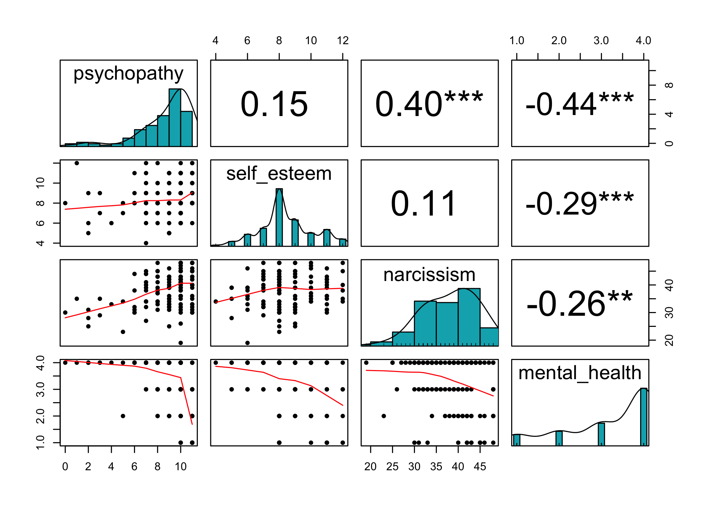<table class="table table-striped table-bordered table-condensed" style="width: auto !important; margin-left: auto; margin-right: auto;">
 <thead>
  <tr>
   <th style="text-align:left;position: sticky; top:0; background-color: #FFFFFF;"> Parameter </th>
   <th style="text-align:right;position: sticky; top:0; background-color: #FFFFFF;"> mental_health </th>
   <th style="text-align:right;position: sticky; top:0; background-color: #FFFFFF;"> narcissism </th>
   <th style="text-align:right;position: sticky; top:0; background-color: #FFFFFF;"> self_esteem </th>
  </tr>
 </thead>
<tbody>
  <tr>
   <td style="text-align:left;"> psychopathy </td>
   <td style="text-align:right;"> -0.44 </td>
   <td style="text-align:right;"> 0.40 </td>
   <td style="text-align:right;"> 0.15 </td>
  </tr>
  <tr>
   <td style="text-align:left;"> self_esteem </td>
   <td style="text-align:right;"> -0.29 </td>
   <td style="text-align:right;"> 0.11 </td>
   <td style="text-align:right;">  </td>
  </tr>
  <tr>
   <td style="text-align:left;"> narcissism </td>
   <td style="text-align:right;"> -0.26 </td>
   <td style="text-align:right;">  </td>
   <td style="text-align:right;">  </td>
  </tr>
</tbody>
</table>


* *Exercise*: Pennycook et al. (2020) investigated the relationship between actively open-minded thinking style about evidence (AOT-E) and different political, scientific, and religious beliefs (see the original paper [here](https://psyarxiv.com/a7k96)). In their first experiment, they calculated the correlation of AOTE and scientific beliefs items (global warming, evolution, etc.) and they found the following results:

<div class="figure" style="text-align: center">

<p class="caption">adapted from [Pennycook et al. (2020)](https://psyarxiv.com/a7k96)</p>
</div>

Open the `pennycook_aote_exp1.csv` file and try to reproduce their results by creating the same correlation matrix.


```r
pennycook_data <- read_csv(here("cleaned_data","pennycook_aote_exp1.csv")) 


#---------- Base R:
cor(pennycook_data, method = "pearson",  use = "complete.obs")

#---------- Psych library:
pennycook_data %>% 
  psych::pairs.panels(method = "pearson", hist.col = "#00AFBB", density = T, ellipses = F, stars = T)

#---------- Correlation library:
correlation::correlation(pennycook_data) %>% summary()

#---------- apaTables library:
pennycook_data %>% 
  apaTables::apa.cor.table(filename="./outputs/CorMatrix.doc", show.conf.interval=T)
```


<div style="border: 1px solid #ddd; padding: 5px; overflow-x: scroll; width:780px; "><table class="table table-striped table-bordered table-condensed" style="width: auto !important; margin-left: auto; margin-right: auto;">
 <thead>
  <tr>
   <th style="text-align:left;position: sticky; top:0; background-color: #FFFFFF;"> Parameter </th>
   <th style="text-align:right;position: sticky; top:0; background-color: #FFFFFF;"> trust_scien </th>
   <th style="text-align:right;position: sticky; top:0; background-color: #FFFFFF;"> gm_health </th>
   <th style="text-align:right;position: sticky; top:0; background-color: #FFFFFF;"> tech_problems </th>
   <th style="text-align:right;position: sticky; top:0; background-color: #FFFFFF;"> modern_medicine </th>
   <th style="text-align:right;position: sticky; top:0; background-color: #FFFFFF;"> old_earth </th>
   <th style="text-align:right;position: sticky; top:0; background-color: #FFFFFF;"> vaccines </th>
   <th style="text-align:right;position: sticky; top:0; background-color: #FFFFFF;"> stem_cell </th>
   <th style="text-align:right;position: sticky; top:0; background-color: #FFFFFF;"> big_bang </th>
   <th style="text-align:right;position: sticky; top:0; background-color: #FFFFFF;"> evolution </th>
   <th style="text-align:right;position: sticky; top:0; background-color: #FFFFFF;"> global_warming </th>
  </tr>
 </thead>
<tbody>
  <tr>
   <td style="text-align:left;"> aote </td>
   <td style="text-align:right;"> 0.35 </td>
   <td style="text-align:right;"> 0.36 </td>
   <td style="text-align:right;"> 0.44 </td>
   <td style="text-align:right;"> 0.33 </td>
   <td style="text-align:right;"> 0.40 </td>
   <td style="text-align:right;"> 0.47 </td>
   <td style="text-align:right;"> 0.45 </td>
   <td style="text-align:right;"> 0.51 </td>
   <td style="text-align:right;"> 0.51 </td>
   <td style="text-align:right;"> 0.37 </td>
  </tr>
  <tr>
   <td style="text-align:left;"> global_warming </td>
   <td style="text-align:right;"> 0.42 </td>
   <td style="text-align:right;"> 0.06 </td>
   <td style="text-align:right;"> 0.14 </td>
   <td style="text-align:right;"> 0.18 </td>
   <td style="text-align:right;"> 0.33 </td>
   <td style="text-align:right;"> 0.26 </td>
   <td style="text-align:right;"> 0.31 </td>
   <td style="text-align:right;"> 0.33 </td>
   <td style="text-align:right;"> 0.38 </td>
   <td style="text-align:right;">  </td>
  </tr>
  <tr>
   <td style="text-align:left;"> evolution </td>
   <td style="text-align:right;"> 0.48 </td>
   <td style="text-align:right;"> 0.33 </td>
   <td style="text-align:right;"> 0.28 </td>
   <td style="text-align:right;"> 0.36 </td>
   <td style="text-align:right;"> 0.47 </td>
   <td style="text-align:right;"> 0.39 </td>
   <td style="text-align:right;"> 0.54 </td>
   <td style="text-align:right;"> 0.78 </td>
   <td style="text-align:right;">  </td>
   <td style="text-align:right;">  </td>
  </tr>
  <tr>
   <td style="text-align:left;"> big_bang </td>
   <td style="text-align:right;"> 0.49 </td>
   <td style="text-align:right;"> 0.37 </td>
   <td style="text-align:right;"> 0.28 </td>
   <td style="text-align:right;"> 0.36 </td>
   <td style="text-align:right;"> 0.45 </td>
   <td style="text-align:right;"> 0.37 </td>
   <td style="text-align:right;"> 0.54 </td>
   <td style="text-align:right;">  </td>
   <td style="text-align:right;">  </td>
   <td style="text-align:right;">  </td>
  </tr>
  <tr>
   <td style="text-align:left;"> stem_cell </td>
   <td style="text-align:right;"> 0.47 </td>
   <td style="text-align:right;"> 0.34 </td>
   <td style="text-align:right;"> 0.36 </td>
   <td style="text-align:right;"> 0.47 </td>
   <td style="text-align:right;"> 0.40 </td>
   <td style="text-align:right;"> 0.40 </td>
   <td style="text-align:right;">  </td>
   <td style="text-align:right;">  </td>
   <td style="text-align:right;">  </td>
   <td style="text-align:right;">  </td>
  </tr>
  <tr>
   <td style="text-align:left;"> vaccines </td>
   <td style="text-align:right;"> 0.43 </td>
   <td style="text-align:right;"> 0.52 </td>
   <td style="text-align:right;"> 0.49 </td>
   <td style="text-align:right;"> 0.53 </td>
   <td style="text-align:right;"> 0.38 </td>
   <td style="text-align:right;">  </td>
   <td style="text-align:right;">  </td>
   <td style="text-align:right;">  </td>
   <td style="text-align:right;">  </td>
   <td style="text-align:right;">  </td>
  </tr>
  <tr>
   <td style="text-align:left;"> old_earth </td>
   <td style="text-align:right;"> 0.29 </td>
   <td style="text-align:right;"> 0.24 </td>
   <td style="text-align:right;"> 0.21 </td>
   <td style="text-align:right;"> 0.33 </td>
   <td style="text-align:right;">  </td>
   <td style="text-align:right;">  </td>
   <td style="text-align:right;">  </td>
   <td style="text-align:right;">  </td>
   <td style="text-align:right;">  </td>
   <td style="text-align:right;">  </td>
  </tr>
  <tr>
   <td style="text-align:left;"> modern_medicine </td>
   <td style="text-align:right;"> 0.43 </td>
   <td style="text-align:right;"> 0.42 </td>
   <td style="text-align:right;"> 0.47 </td>
   <td style="text-align:right;">  </td>
   <td style="text-align:right;">  </td>
   <td style="text-align:right;">  </td>
   <td style="text-align:right;">  </td>
   <td style="text-align:right;">  </td>
   <td style="text-align:right;">  </td>
   <td style="text-align:right;">  </td>
  </tr>
  <tr>
   <td style="text-align:left;"> tech_problems </td>
   <td style="text-align:right;"> 0.33 </td>
   <td style="text-align:right;"> 0.39 </td>
   <td style="text-align:right;">  </td>
   <td style="text-align:right;">  </td>
   <td style="text-align:right;">  </td>
   <td style="text-align:right;">  </td>
   <td style="text-align:right;">  </td>
   <td style="text-align:right;">  </td>
   <td style="text-align:right;">  </td>
   <td style="text-align:right;">  </td>
  </tr>
  <tr>
   <td style="text-align:left;"> gm_health </td>
   <td style="text-align:right;"> 0.31 </td>
   <td style="text-align:right;">  </td>
   <td style="text-align:right;">  </td>
   <td style="text-align:right;">  </td>
   <td style="text-align:right;">  </td>
   <td style="text-align:right;">  </td>
   <td style="text-align:right;">  </td>
   <td style="text-align:right;">  </td>
   <td style="text-align:right;">  </td>
   <td style="text-align:right;">  </td>
  </tr>
</tbody>
</table></div>


## Linear Regression

Here, we do single and multiple linear regreassion on the `narcissism_data`:


```r
m1 <- lm(mental_health~narcissism, data= narcissism_data)
```

<table class="table table-striped table-bordered table-condensed" style="margin-left: auto; margin-right: auto;">
 <thead>
  <tr>
   <th style="text-align:left;position: sticky; top:0; background-color: #FFFFFF;"> term </th>
   <th style="text-align:right;position: sticky; top:0; background-color: #FFFFFF;"> estimate </th>
   <th style="text-align:right;position: sticky; top:0; background-color: #FFFFFF;"> std.error </th>
   <th style="text-align:right;position: sticky; top:0; background-color: #FFFFFF;"> statistic </th>
   <th style="text-align:right;position: sticky; top:0; background-color: #FFFFFF;"> p.value </th>
  </tr>
 </thead>
<tbody>
  <tr>
   <td style="text-align:left;"> (Intercept) </td>
   <td style="text-align:right;"> 4.86 </td>
   <td style="text-align:right;"> 0.56 </td>
   <td style="text-align:right;"> 8.75 </td>
   <td style="text-align:right;"> 0 </td>
  </tr>
  <tr>
   <td style="text-align:left;"> narcissism </td>
   <td style="text-align:right;"> -0.04 </td>
   <td style="text-align:right;"> 0.01 </td>
   <td style="text-align:right;"> -3.04 </td>
   <td style="text-align:right;"> 0 </td>
  </tr>
</tbody>
</table>


```r
m2 <- lm(mental_health~narcissism+psychopathy, data= narcissism_data)
```

<table class="table table-striped table-bordered table-condensed" style="margin-left: auto; margin-right: auto;">
 <thead>
  <tr>
   <th style="text-align:left;position: sticky; top:0; background-color: #FFFFFF;"> term </th>
   <th style="text-align:right;position: sticky; top:0; background-color: #FFFFFF;"> estimate </th>
   <th style="text-align:right;position: sticky; top:0; background-color: #FFFFFF;"> std.error </th>
   <th style="text-align:right;position: sticky; top:0; background-color: #FFFFFF;"> statistic </th>
   <th style="text-align:right;position: sticky; top:0; background-color: #FFFFFF;"> p.value </th>
  </tr>
 </thead>
<tbody>
  <tr>
   <td style="text-align:left;"> (Intercept) </td>
   <td style="text-align:right;"> 5.43 </td>
   <td style="text-align:right;"> 0.53 </td>
   <td style="text-align:right;"> 10.27 </td>
   <td style="text-align:right;"> 0.00 </td>
  </tr>
  <tr>
   <td style="text-align:left;"> narcissism </td>
   <td style="text-align:right;"> -0.02 </td>
   <td style="text-align:right;"> 0.01 </td>
   <td style="text-align:right;"> -1.09 </td>
   <td style="text-align:right;"> 0.28 </td>
  </tr>
  <tr>
   <td style="text-align:left;"> psychopathy </td>
   <td style="text-align:right;"> -0.19 </td>
   <td style="text-align:right;"> 0.04 </td>
   <td style="text-align:right;"> -4.71 </td>
   <td style="text-align:right;"> 0.00 </td>
  </tr>
</tbody>
</table>

* *Exercise*: Trémolière and Djeriouat (2020) examined the role of *cognitive reflection* and *belief in science* in climate change skepticism. In their first study, they revealed that cognitive reflection and belief in science negetively predicted climate change skepticism even after controlling for demographic and cognitive ability variables (see the original paper [here](https://psyarxiv.com/vp8k6/)). 

<div class="figure" style="text-align: center">

<p class="caption">adapted from [Trémolière and Djeriouat (2020)](https://psyarxiv.com/vp8k6/)</p>
</div>

Open the `tremoliere_data_exp1.csv` file and try to reproduce their results by running a multiple linear regression. Enter age, gender, education, belief in science, literacy, numeracy (Numtotal), and cognitive reflection as predictors and enter climate change skepticism (climato) as the outcome variable.


```r
Tremoliere_data <- read_csv(here("cleaned_data","tremoliere_data_exp1.csv"))

Tremoliere_reg=lm(Climato ~ Age+ Gender+ Education+ BeliefInSciencetotal+ Literacy+ Numtotal+ CognitiveReflection,
                    data=Tremoliere_data)
```


<table class="table table-striped table-bordered table-condensed" style="margin-left: auto; margin-right: auto;">
 <thead>
  <tr>
   <th style="text-align:left;position: sticky; top:0; background-color: #FFFFFF;"> term </th>
   <th style="text-align:right;position: sticky; top:0; background-color: #FFFFFF;"> estimate </th>
   <th style="text-align:right;position: sticky; top:0; background-color: #FFFFFF;"> std.error </th>
   <th style="text-align:right;position: sticky; top:0; background-color: #FFFFFF;"> statistic </th>
   <th style="text-align:right;position: sticky; top:0; background-color: #FFFFFF;"> p.value </th>
  </tr>
 </thead>
<tbody>
  <tr>
   <td style="text-align:left;"> (Intercept) </td>
   <td style="text-align:right;"> 57.57 </td>
   <td style="text-align:right;"> 5.19 </td>
   <td style="text-align:right;"> 11.09 </td>
   <td style="text-align:right;"> 0.00 </td>
  </tr>
  <tr>
   <td style="text-align:left;"> Age </td>
   <td style="text-align:right;"> 0.01 </td>
   <td style="text-align:right;"> 0.05 </td>
   <td style="text-align:right;"> 0.24 </td>
   <td style="text-align:right;"> 0.81 </td>
  </tr>
  <tr>
   <td style="text-align:left;"> Gender </td>
   <td style="text-align:right;"> -5.68 </td>
   <td style="text-align:right;"> 1.34 </td>
   <td style="text-align:right;"> -4.23 </td>
   <td style="text-align:right;"> 0.00 </td>
  </tr>
  <tr>
   <td style="text-align:left;"> Education </td>
   <td style="text-align:right;"> 0.54 </td>
   <td style="text-align:right;"> 0.38 </td>
   <td style="text-align:right;"> 1.43 </td>
   <td style="text-align:right;"> 0.15 </td>
  </tr>
  <tr>
   <td style="text-align:left;"> BeliefInSciencetotal </td>
   <td style="text-align:right;"> -0.20 </td>
   <td style="text-align:right;"> 0.06 </td>
   <td style="text-align:right;"> -3.62 </td>
   <td style="text-align:right;"> 0.00 </td>
  </tr>
  <tr>
   <td style="text-align:left;"> Literacy </td>
   <td style="text-align:right;"> -0.49 </td>
   <td style="text-align:right;"> 0.51 </td>
   <td style="text-align:right;"> -0.96 </td>
   <td style="text-align:right;"> 0.34 </td>
  </tr>
  <tr>
   <td style="text-align:left;"> Numtotal </td>
   <td style="text-align:right;"> -1.52 </td>
   <td style="text-align:right;"> 0.83 </td>
   <td style="text-align:right;"> -1.82 </td>
   <td style="text-align:right;"> 0.07 </td>
  </tr>
  <tr>
   <td style="text-align:left;"> CognitiveReflection </td>
   <td style="text-align:right;"> -18.58 </td>
   <td style="text-align:right;"> 4.26 </td>
   <td style="text-align:right;"> -4.37 </td>
   <td style="text-align:right;"> 0.00 </td>
  </tr>
</tbody>
</table>

<div style="border: 1px solid #ddd; padding: 5px; overflow-x: scroll; width:780px; "><table class="table table-striped table-bordered table-condensed" style="width: auto !important; margin-left: auto; margin-right: auto;">
 <thead>
  <tr>
   <th style="text-align:right;position: sticky; top:0; background-color: #FFFFFF;"> r.squared </th>
   <th style="text-align:right;position: sticky; top:0; background-color: #FFFFFF;"> adj.r.squared </th>
   <th style="text-align:right;position: sticky; top:0; background-color: #FFFFFF;"> sigma </th>
   <th style="text-align:right;position: sticky; top:0; background-color: #FFFFFF;"> statistic </th>
   <th style="text-align:right;position: sticky; top:0; background-color: #FFFFFF;"> p.value </th>
   <th style="text-align:right;position: sticky; top:0; background-color: #FFFFFF;"> df </th>
   <th style="text-align:right;position: sticky; top:0; background-color: #FFFFFF;"> logLik </th>
   <th style="text-align:right;position: sticky; top:0; background-color: #FFFFFF;"> AIC </th>
   <th style="text-align:right;position: sticky; top:0; background-color: #FFFFFF;"> BIC </th>
   <th style="text-align:right;position: sticky; top:0; background-color: #FFFFFF;"> deviance </th>
   <th style="text-align:right;position: sticky; top:0; background-color: #FFFFFF;"> df.residual </th>
   <th style="text-align:right;position: sticky; top:0; background-color: #FFFFFF;"> nobs </th>
  </tr>
 </thead>
<tbody>
  <tr>
   <td style="text-align:right;"> 0.19 </td>
   <td style="text-align:right;"> 0.17 </td>
   <td style="text-align:right;"> 12.65 </td>
   <td style="text-align:right;"> 11.91 </td>
   <td style="text-align:right;"> 0 </td>
   <td style="text-align:right;"> 7 </td>
   <td style="text-align:right;"> -1467.77 </td>
   <td style="text-align:right;"> 2953.54 </td>
   <td style="text-align:right;"> 2988.81 </td>
   <td style="text-align:right;"> 58235.89 </td>
   <td style="text-align:right;"> 364 </td>
   <td style="text-align:right;"> 372 </td>
  </tr>
</tbody>
</table></div>


# Rmarkdown

To be completed...


<div class="figure" style="text-align: center">

<p class="caption">Artwork by Allison Horst: https://github.com/allisonhorst/stats-illustrations</p>
</div>


<div class="figure" style="text-align: center">

<p class="caption">Artwork by Allison Horst: https://github.com/allisonhorst/stats-illustrations</p>
</div>

# References

- Ghasemi, O., Handley, S., & Howarth, S. (2020). The Bright Homunculus in our Head: Individual Differences in Intuitive Sensitivity to Logical Validity.

- John, L. K., Jeong, M., Gino, F., & Huang, L. (2019). The self-presentational consequences of upholding one’s stance in spite of the evidence. Organizational Behavior and Human Decision Processes, 154, 1-14.

- Pennycook, G., Cheyne, J. A., Koehler, D. J., & Fugelsang, J. A. (2020). On the belief that beliefs should change according to evidence: Implications for conspiratorial, moral, paranormal, political, religious, and science beliefs. Judgment and Decision Making, 15(4), 476.

- Rotello, C. M., Kelly, L. J., Heit, E., Vazire, S., & Vul, E. (2018). The Shape of ROC Curves in Shooter Tasks: Implications for Best Practices in Analysis. Collabra: Psychology, 4(1).

- Trémolière, B., & Djeriouat, H. (2020). Don’t you see that its cold! Exploring the roles of cognitive reflection, climate science literacy, illusion of knowledge, and political orientation in climate change skepticism.

- Wickham, H. (2014). Tidy data. Journal of Statistical Software, 59(10), 1-23.
